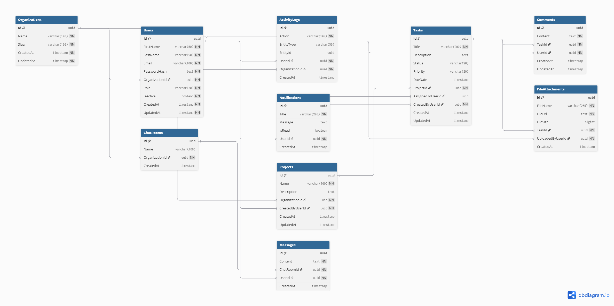

# WorkSphere

> **Enterprise-grade multi-tenant project management platform** built for teams that demand reliability, scalability, and real-time collaboration — designed to be licensed and deployed across organizations of any size.

[](https://dotnet.microsoft.com/)
[](https://www.postgresql.org/)
[](https://react.dev/)
[]()
[]()

---

## 📌 Overview

WorkSphere is a **multi-tenant SaaS platform** that enables organizations to manage projects, assign tasks, collaborate in real time, and track progress — all within a fully isolated, role-based workspace.

Built for **B2B commercial licensing**, WorkSphere is architected to serve multiple independent organizations from a single deployment, with strict data isolation, JWT-based authentication, and a fully auditable activity system.

---

## 🏗️ Architecture

```
┌─────────────────────────────────────────────────────────────┐
│                        CLIENT LAYER                         │
│          React 18 + Vite + Tailwind CSS + TanStack          │
└─────────────────────┬───────────────────────────────────────┘
                      │ HTTPS / WebSocket (SignalR)
┌─────────────────────▼───────────────────────────────────────┐
│                        API LAYER                            │
│         ASP.NET Core 9 Web API  |  JWT Auth  |  SignalR     │
│         FluentValidation  |  Serilog  |  Global Error       │
└─────────────────────┬───────────────────────────────────────┘
                      │ EF Core 9
┌─────────────────────▼───────────────────────────────────────┐
│                      DATA LAYER                             │
│         PostgreSQL 18  |  Redis Cache  |  EF Core ORM       │
│         Multi-Tenant Isolation via TenantId (OrgId)         │
└─────────────────────────────────────────────────────────────┘
```

---

## 🛠️ Tech Stack

| Layer            | Technology                                                   |
|------------------|--------------------------------------------------------------|
| **Backend**      | .NET 9, ASP.NET Core Web API, EF Core 9                      |
| **Database**     | PostgreSQL 18, Redis (caching), EF Core Migrations           |
| **Auth**         | JWT Bearer Tokens, Refresh Token Rotation, BCrypt, RBAC      |
| **Real-Time**    | ASP.NET Core SignalR                                         |
| **Validation**   | FluentValidation                                             |
| **Logging**      | Serilog (structured, file sink)                              |
| **Frontend**     | React 18, Vite, Tailwind CSS, TanStack Query, React Router v6|
| **UI**           | dnd-kit, Recharts, React Hook Form, Zod                      |
| **DevOps**       | Docker, GitHub Actions CI/CD, Render/Railway, Vercel         |
| **Storage**      | AWS S3 / Cloudinary, Supabase / Neon (PostgreSQL cloud)      |
| **Docs**         | Swagger / OpenAPI 3.0                                        |

---

## 📦 Backend Dependencies

| Package                                        | Version  | Purpose                        |
|------------------------------------------------|----------|--------------------------------|
| `Npgsql.EntityFrameworkCore.PostgreSQL`        | 9.0.4    | PostgreSQL provider for EF Core|
| `Microsoft.EntityFrameworkCore.Design`         | 9.0.4    | Migrations & tooling           |
| `Microsoft.EntityFrameworkCore.Tools`          | 9.0.4    | EF Core CLI                    |
| `Microsoft.AspNetCore.Authentication.JwtBearer`| 9.0.4    | JWT authentication             |
| `BCrypt.Net-Next`                              | 4.1.0    | Password hashing               |
| `FluentValidation.AspNetCore`                  | 11.3.1   | Request validation             |
| `Serilog.AspNetCore`                           | 10.0.0   | Structured logging             |
| `Swashbuckle.AspNetCore`                       | 6.9.0    | Swagger / OpenAPI docs         |

---

## 🗂️ Project Structure

```
WorkSphere/
├── WorkHub.API/
│   ├── Authorization/            # Permission system — policies, handlers, guards
│   │   ├── OrgScopeGuard.cs      # IDOR protection — cross-tenant access blocked
│   │   ├── PermissionHandler.cs  # Custom IAuthorizationRequirement handler
│   │   ├── PermissionRequirement.cs
│   │   ├── Permissions.cs        # 25 permission constants across 6 areas
│   │   ├── PolicyNames.cs        # 22 named policy constants
│   │   └── RolePermissions.cs    # Owner/Admin/Member permission matrix
│   ├── Controllers/              # API route handlers
│   ├── Data/
│   │   ├── AppDbContext.cs       # EF Core DbContext + SaveChanges override
│   │   └── Seeding/
│   │       ├── DataSeeder.cs     # Idempotent seeder — 3 orgs, 8 users, 4 projects, 9 tasks
│   │       └── SeedReference.cs  # Fixed UUIDs for all seed data
│   ├── DTOs/                     # Request & response transfer objects
│   ├── Middleware/
│   │   ├── GlobalExceptionMiddleware.cs  # Unhandled exception → ApiResponse<T>
│   │   ├── RequestLoggingMiddleware.cs   # Correlation ID + method/path/status/ms
│   │   └── TenantMiddleware.cs           # Real-time user + org status check
│   ├── Migrations/               # EF Core auto-generated migrations
│   ├── Models/
│   │   ├── BaseEntity.cs         # Abstract base: Id, CreatedAt, UpdatedAt, soft delete
│   │   ├── Organization.cs       # Tenant / organization model
│   │   ├── OrganizationInvite.cs # Invite model with token + lifecycle
│   │   ├── Project.cs            # Project container with status + lead
│   │   ├── Task.cs               # WorkTask model with priority + time tracking
│   │   ├── TaskAssignee.cs       # Junction table — many-to-many task assignments
│   │   ├── User.cs               # Platform user model
│   │   └── UserRole.cs           # Role constants: Owner, Admin, Member
│   ├── Services/                 # Business logic layer
│   ├── Settings/                 # Strongly-typed config classes
│   ├── appsettings.json          # App configuration
│   └── Program.cs                # Application entry point & DI setup
├── docs/                         # Architecture & ER diagrams
├── .gitignore
└── WorkHub.sln
```

---

## 🗄️ Database Schema
 
### BaseEntity *(inherited by all models)*
 
| Column      | Type        | Notes                              |
|-------------|-------------|------------------------------------|
| `Id`        | `UUID`      | Primary key, auto-generated        |
| `CreatedAt` | `TIMESTAMP` | Set automatically on insert        |
| `UpdatedAt` | `TIMESTAMP` | Auto-updated on every save         |
| `IsDeleted` | `BOOLEAN`   | Soft delete flag — default `false` |
| `DeletedAt` | `TIMESTAMP` | Set on soft delete — nullable      |
 
---
 
### Organizations
 
| Column        | Type           | Constraints      |
|---------------|----------------|------------------|
| `Id`          | `UUID`         | PK               |
| `Name`        | `VARCHAR(100)` | Required         |
| `Slug`        | `VARCHAR(100)` | Required, Unique |
| `Description` | `VARCHAR(500)` | Nullable         |
| `LogoUrl`     | `VARCHAR(255)` | Nullable         |
| `Plan`        | `VARCHAR(20)`  | Default: `Free`  |
| `IsActive`    | `BOOLEAN`      | Default: `true`  |
 
---
 
### Users
 
| Column           | Type           | Constraints           |
|------------------|----------------|-----------------------|
| `Id`             | `UUID`         | PK                    |
| `FirstName`      | `VARCHAR(50)`  | Required              |
| `LastName`       | `VARCHAR(50)`  | Required              |
| `Email`          | `VARCHAR(100)` | Required, Unique      |
| `PasswordHash`   | `TEXT`         | BCrypt hashed         |
| `OrganizationId` | `UUID`         | FK → Organizations.Id |
| `Role`           | `VARCHAR(20)`  | Owner / Admin / Member|
| `IsActive`       | `BOOLEAN`      | Default: `true`       |
| `RefreshToken`   | `TEXT`         | Nullable              |
 
---
 
### Projects
 
| Column             | Type           | Constraints           |
|--------------------|----------------|-----------------------|
| `Id`               | `UUID`         | PK                    |
| `Name`             | `VARCHAR(200)` | Required              |
| `Description`      | `TEXT`         | Nullable              |
| `Status`           | `VARCHAR(20)`  | Active / OnHold / Completed / Archived |
| `OrganizationId`   | `UUID`         | FK → Organizations.Id (Cascade) |
| `CreatedByUserId`  | `UUID`         | FK → Users.Id (Restrict) |
| `ProjectLeadUserId`| `UUID`         | FK → Users.Id (Restrict, nullable) |
| `StartDate`        | `TIMESTAMP`    | Nullable              |
| `DueDate`          | `TIMESTAMP`    | Nullable              |
 
---
 
### Tasks
 
| Column              | Type           | Constraints              |
|---------------------|----------------|--------------------------|
| `Id`                | `UUID`         | PK                       |
| `Title`             | `VARCHAR(500)` | Required                 |
| `Description`       | `TEXT`         | Nullable                 |
| `Status`            | `VARCHAR(20)`  | Todo / InProgress / InReview / Done / Cancelled |
| `Priority`          | `VARCHAR(20)`  | Low / Medium / High / Urgent |
| `ProjectId`         | `UUID`         | FK → Projects.Id (Cascade) |
| `OrganizationId`    | `UUID`         | FK → Organizations.Id    |
| `CreatedByUserId`   | `UUID`         | FK → Users.Id (Restrict) |
| `AssignedToUserId`  | `UUID`         | FK → Users.Id (Restrict, nullable) |
| `ParentTaskId`      | `UUID`         | Self-ref FK (subtasks, nullable) |
| `EstimatedMinutes`  | `INT`          | Nullable                 |
| `ActualMinutes`     | `INT`          | Nullable                 |
| `OrderIndex`        | `INT`          | Kanban ordering, default 0 |
| `CompletedAt`       | `TIMESTAMP`    | Nullable — set when Done |
 
---
 
### TaskAssignees *(junction table)*
 
| Column            | Type        | Constraints              |
|-------------------|-------------|--------------------------|
| `TaskId`          | `UUID`      | PK (composite) + FK → Tasks.Id (Cascade) |
| `UserId`          | `UUID`      | PK (composite) + FK → Users.Id (Cascade) |
| `AssignedByUserId`| `UUID`      | FK → Users.Id (Restrict) |
| `AssignedAt`      | `TIMESTAMP` | Auto                     |
 
---
 
### OrganizationInvites
 
| Column             | Type           | Notes                    |
|--------------------|----------------|--------------------------|
| `Id`               | `UUID`         | PK                       |
| `OrganizationId`   | `UUID`         | FK → Organizations       |
| `InvitedByUserId`  | `UUID`         | FK → Users               |
| `InviteeEmail`     | `VARCHAR(100)` | Who the invite is for    |
| `Role`             | `VARCHAR(20)`  | Role on join             |
| `Token`            | `TEXT`         | Unique, 32-byte CSPRNG   |
| `ExpiresAt`        | `TIMESTAMP`    | 7 days from creation     |
| `Status`           | `VARCHAR(20)`  | Pending/Accepted/Expired/Cancelled |
 
---
 
### Role Permissions Matrix
 
```
┌────────────────────────────┬────────┬───────┬────────┐
│ Permission Area            │ Owner  │ Admin │ Member │
├────────────────────────────┼────────┼───────┼────────┤
│ Organizations (view/update)│  ✅    │  ✅/❌│  ✅/❌ │
│ Members (view/invite/kick) │  ✅    │  ✅   │  view  │
│ Projects (full CRUD)       │  ✅    │  ✅   │  view  │
│ Tasks (full CRUD)          │  ✅    │  ✅   │  own   │
│ Comments (create/delete)   │  ✅    │  ✅   │  own   │
│ Reports (view/export)      │  ✅    │  view │  ❌    │
├────────────────────────────┼────────┼───────┼────────┤
│ Total permissions          │  25    │  18   │   8    │
└────────────────────────────┴────────┴───────┴────────┘
```

---
 
### Entity Relationships
 
```
Organizations (1) ────────── (many) Users
      │                              │
      │                              │
      └── (many) Projects ─── (many) Tasks ─── (many) TaskAssignees
                                     │
                                     └── (many) SubTasks (self-ref)
```
 
---

## ⚙️ Local Development Setup

### Prerequisites

- [.NET 9 SDK](https://dotnet.microsoft.com/download)
- [PostgreSQL 18](https://www.postgresql.org/download/)
- [Git](https://git-scm.com/)
- [Node.js 20+](https://nodejs.org/) *(required for frontend — Phase 3)*

---

### 1. Clone the Repository

```bash
git clone https://github.com/Martian-X1X/WorkSphere.git
cd WorkSphere
```

### 2. Create the Database

Using PostgreSQL CLI or pgAdmin 4:
```sql
CREATE DATABASE workhub_db;
```

### 3. Configure Connection String

Edit `WorkHub.API/appsettings.json`:
```json
{
  "ConnectionStrings": {
    "DefaultConnection": "Host=localhost;Port=5432;Database=workhub_db;Username=postgres;Password=YOUR_PASSWORD"
  }
}
```

> ⚠️ Never commit `appsettings.json` with real credentials. Use environment variables or secrets management in production.

### 4. Install EF Core CLI Tools

```bash
dotnet tool install --global dotnet-ef
```

### 5. Apply Migrations

```bash
cd WorkHub.API
dotnet ef database update
```

### 6. Run the API

```bash
dotnet run
```

### 7. Open Swagger UI

```
http://localhost:5210/swagger
```

---

## 🗺️ Full Database Roadmap

| # | Table             | Phase   | Day     | Purpose                          |
|---|-------------------|---------|---------|----------------------------------|
| 1 | `Organizations`   | Phase 1 | Day 2   | Tenant isolation                 |
| 2 | `Users`           | Phase 1 | Day 2   | Authentication & roles           |
| 3 | `Projects`        | Phase 2 | Day 18  | Project containers               |
| 4 | `Tasks`           | Phase 2 | Day 19  | Work items inside projects       |
| 5 | `TaskAssignees`   | Phase 2 | Day 22  | User-task assignments            |
| 6 | `Comments`        | Phase 2 | Day 27  | Task-level discussions           |
| 7 | `ActivityLogs`    | Phase 2 | Day 28  | Full audit trail                 |
| 8 | `Notifications`   | Phase 4 | Day 61  | In-app notification system       |
| 9 | `ChatRooms`       | Phase 5 | Day 70  | Real-time team messaging         |
|10 | `Messages`        | Phase 5 | Day 70  | Chat messages per room           |
|11 | `FileAttachments` | Phase 5 | Day 77  | Files linked to tasks            |

---

## 📅 Development Logs

### ✅ Day 1 — Infrastructure Setup
- Initialized .NET 9 Web API project and solution
- Configured PostgreSQL 18 connection via EF Core
- Installed and pinned all NuGet packages to .NET 9 compatible versions
- Created `AppDbContext` with PostgreSQL provider
- Ran initial EF Core migration — database connected and verified
- Swagger UI operational at `http://localhost:5210/swagger`
- Repository published to GitHub

### ✅ Day 2 — Core Domain Modeling
- Designed full database schema for Phase 1 (Organizations + Users)
- Implemented `BaseEntity` abstract class — all models inherit `Id`, `CreatedAt`, `UpdatedAt`
- Built `Organization` model with slug-based unique identification
- Built `User` model with BCrypt-ready password hash field and FK to Organization
- Created `UserRole` constants: `Owner`, `Admin`, `Member`
- Configured EF Core fluent API: unique indexes, max lengths, cascade deletes
- Added automatic `UpdatedAt` refresh in `SaveChangesAsync` override
- Ran named migration `AddOrganizationAndUserTables` — tables verified in pgAdmin 4

---

### ✅ Day 3 — Full Schema Design & ER Diagram

## 📊 ER Diagram

<p align="center">
  
</p>

<details open>
- Designed the **complete 11-table database schema** covering all platform features
- Defined all entities: `Projects`, `Tasks`, `Comments`, `FileAttachments`, `ActivityLogs`, `Notifications`, `ChatRooms`, `Messages`
- Mapped all **foreign key relationships** with `DEFERRABLE INITIALLY IMMEDIATE` constraints
- Documented column types, constraints, and enum values (`Status`, `Priority`, `Role`)
- Generated the **full ER Diagram** — visualizing all tables, columns, and relationships
- Published schema as `.sql` source file and diagram to `docs/`
</details>


### ✅ Day 4 — Database Connection Hardening
 
> 🎯 **Goal:** Make the database layer secure, resilient, and production-observable
 
| Task | Status |
|------|--------|
| Migrated credentials to `.NET User Secrets` — connection string removed from source control | ✅ |
| Added EF Core **retry resilience** — 3 retries with 5-second delay on transient failures | ✅ |
| Enabled **SQL query logging** in development — every EF Core command visible in console | ✅ |
| Enabled **detailed EF Core error messages** for development debugging | ✅ |
| Installed `HealthChecks.EntityFrameworkCore` package | ✅ |
| Registered and mapped `/health` endpoint — returns `Healthy` confirming DB connectivity | ✅ |
| Verified both applied migrations via `dotnet ef migrations list` | ✅ |
| Verified all table columns, constraints, and indexes in pgAdmin 4 | ✅ |
| Confirmed FK constraint: `FK_Users_Organizations_OrganizationId` | ✅ |
| Confirmed unique indexes: `IX_Users_Email`, `IX_Organizations_Slug` | ✅ |
| Tested raw SQL insert / read / delete in pgAdmin Query Tool — passed | ✅ |
 
**Migration Status:**
```
✔  20260419_InitialCreate                    [Applied]
✔  20260420_AddOrganizationAndUserTables     [Applied]
```
 
**Active Endpoints after Day 4:**
 
| Method | Endpoint   | Description           | Auth   |
|--------|------------|-----------------------|--------|
| `GET`  | `/health`  | Database health check | Public |
| `GET`  | `/swagger` | API documentation UI  | Public |
 
---
### ✅ Day 5 — Production-Grade Model Upgrade
 
> 🎯 **Goal:** Upgrade all models, introduce DTOs, soft delete, and service layer foundation
 
| Task | Status |
|---|---|
| Upgraded `BaseEntity` with soft delete — `IsDeleted`, `DeletedAt` | ✅ |
| Intercepted hard deletes in `SaveChangesAsync` → converted to soft delete | ✅ |
| Added EF Core global query filters — deleted records excluded from all queries | ✅ |
| Upgraded `Organization` model — `Description`, `LogoUrl`, `Plan` fields | ✅ |
| Upgraded `User` model — `IsEmailVerified`, `LastLoginAt`, `ProfilePictureUrl` | ✅ |
| Added auth token fields to `User` — `RefreshToken`, `EmailVerificationToken`, `PasswordResetToken` | ✅ |
| Added `FullName` computed property (not persisted to DB) | ✅ |
| Upgraded `UserRole` with `IsValid()` helper and `All` array | ✅ |
| Created `RegisterRequestDto` with full validation annotations | ✅ |
| Created `LoginRequestDto` | ✅ |
| Created `AuthResponseDto` + `UserDto` — safe API response shapes | ✅ |
| Created `OrganizationDto` + `CreateOrganizationDto` | ✅ |
| Created `ISlugService` interface in `Interfaces/` | ✅ |
| Implemented `SlugService` — generates URL slugs + ensures uniqueness in DB | ✅ |
| Registered `ISlugService` / `SlugService` in DI container | ✅ |
| Ran migration `UpgradeModelsDay5` — all new columns verified in pgAdmin 4 | ✅ |
 
**Migration History after Day 5:**
```
✔  20260419_InitialCreate                      [Applied]
✔  20260420_AddOrganizationAndUserTables        [Applied]
✔  20260421_UpgradeModelsDay5                   [Applied]
```
 
**New Columns Added — Organizations:**
```
+ Description          VARCHAR(500)    nullable
+ LogoUrl              VARCHAR(255)    nullable
+ Plan                 VARCHAR(20)     default: 'Free'
+ IsDeleted            BOOLEAN         default: false
+ DeletedAt            TIMESTAMP       nullable
```
 
**New Columns Added — Users:**
```
+ IsEmailVerified          BOOLEAN      default: false
+ LastLoginAt              TIMESTAMP    nullable
+ ProfilePictureUrl        TEXT         nullable
+ RefreshToken             TEXT         nullable
+ RefreshTokenExpiry       TIMESTAMP    nullable
+ EmailVerificationToken   TEXT         nullable
+ EmailVerificationExpiry  TIMESTAMP    nullable
+ PasswordResetToken       TEXT         nullable
+ PasswordResetExpiry      TIMESTAMP    nullable
+ IsDeleted                BOOLEAN      default: false
+ DeletedAt                TIMESTAMP    nullable
```
 
**Live Endpoints after Day 5:**
 
| Method | Endpoint | Description | Auth |
|---|---|---|---|
| `GET` | `/health` | Database health check | Public |
| `GET` | `/swagger` | API documentation UI | Public |
 
---

### ✅ Day 6 — User Registration API
 
> 🎯 **Goal:** Build `POST /api/auth/register` — the first real working endpoint with full validation, BCrypt hashing, auto slug generation, and atomic DB writes
 
| Task | Status |
|---|---|
| Created `ApiResponse<T>` universal response wrapper in `DTOs/Common/` | ✅ |
| Suppressed ASP.NET default validation format — all errors use `ApiResponse<T>` | ✅ |
| Created `IAuthService` interface in `Interfaces/` | ✅ |
| Implemented `AuthService` with full registration logic | ✅ |
| Email normalization — trimmed + lowercased before DB check | ✅ |
| Email uniqueness check — `409 Conflict` if already registered | ✅ |
| Auto slug generation via `ISlugService` — `"Martian Labs"` → `"martian-labs"` | ✅ |
| BCrypt password hashing — work factor `12` (~300ms, production-safe) | ✅ |
| Organization + User created atomically in single `SaveChangesAsync` | ✅ |
| First registered user automatically assigned `Owner` role | ✅ |
| Created `AuthController` — thin controller, all logic in service | ✅ |
| Correct HTTP status codes: `201 Created`, `400 Bad Request`, `409 Conflict` | ✅ |
| Registered `IAuthService` / `AuthService` in DI container | ✅ |
| All edge cases tested in Postman — all passing | ✅ |
| BCrypt hash verified in pgAdmin — `$2a$12$...` format confirmed | ✅ |
 
---
 
#### 🔌 Endpoint Reference
 
| Method | Endpoint | Description | Auth |
|---|---|---|---|
| `POST` | `/api/auth/register` | Register new org + owner account | Public |
| `GET` | `/health` | Database health check | Public |
| `GET` | `/swagger` | API documentation UI | Public |
 
---
 
#### 📬 Postman Test Suite — `POST /api/auth/register`
 
**Base URL:** `http://localhost:5210/api/auth/register`
**Headers:** `Content-Type: application/json`
 
---
 
##### ✅ Test 1 — Happy Path: Successful Registration
 
**Request Body:**
```json
{
  "firstName": "Abdul",
  "lastName": "Martian",
  "email": "abdul@worksphere.io",
  "password": "SecurePass123!",
  "organizationName": "Martian Labs"
}
```
 
**Response — `201 Created`:**
```json
{
  "success": true,
  "message": "Registration successful. Welcome to WorkSphere!",
  "data": {
    "accessToken": "",
    "refreshToken": "",
    "expiresAt": "2026-05-04T10:44:12.4607028Z",
    "user": {
      "id": "1f91c17c-c2f8-48ff-90f6-c09c7e8fda55",
      "firstName": "Abdul",
      "lastName": "Martian",
      "fullName": "Abdul Martian",
      "email": "abdul@worksphere.io",
      "role": "Owner",
      "organizationId": "c85699b6-5cb3-4ca9-9107-287ed66e3caf",
      "organizationName": "Martian Labs",
      "isEmailVerified": false,
      "profilePictureUrl": null
    }
  },
  "errors": [],
  "timestamp": "2026-05-04T10:44:12.46139Z"
}
```
 
> 🟢 Organization created with slug `martian-labs`. User assigned `Owner` role. Password stored as BCrypt hash `$2a$12$...`. Tokens will be populated on Day 8 (JWT).
 
---
 
##### ❌ Test 2 — Duplicate Email: Conflict
 
**Request Body:**
```json
{
  "firstName": "Abdul",
  "lastName": "Martian",
  "email": "abdul@worksphere.io",
  "password": "SecurePass123!",
  "organizationName": "Another Labs"
}
```
 
**Response — `409 Conflict`:**
```json
{
  "success": false,
  "message": "An account with this email address already exists.",
  "data": null,
  "errors": [
    "An account with this email address already exists."
  ],
  "timestamp": "2026-05-04T10:15:24.001749Z"
}
```
 
> 🔴 Email uniqueness enforced at service level before any DB write. No duplicate organizations created.
 
---
 
##### ❌ Test 3 — Missing All Required Fields: Validation Error
 
**Request Body:**
```json
{
  "firstName": "",
  "email": "notvalid",
  "password": "123"
}
```
 
**Response — `400 Bad Request`:**
```json
{
  "success": false,
  "message": "Validation failed",
  "data": null,
  "errors": [
    "Invalid email address",
    "Last name is required",
    "Password must be at least 8 characters",
    "First name is required",
    "Organization name is required"
  ],
  "timestamp": "2026-05-04T10:44:58.8296049Z"
}
```
 
> 🔴 All validation errors returned in a single response. Custom `ApiResponse<T>` format used — no ASP.NET default error shape.
 
---
 
##### ❌ Test 4 — Invalid Email Format
 
**Request Body:**
```json
{
  "firstName": "Abdul",
  "lastName": "Martian",
  "email": "not-an-email",
  "password": "SecurePass123!",
  "organizationName": "Martian Labs"
}
```
 
**Response — `400 Bad Request`:**
```json
{
  "success": false,
  "message": "Validation failed",
  "data": null,
  "errors": [
    "Invalid email address"
  ],
  "timestamp": "2026-05-04T10:45:13.6631008Z"
}
```
 
---
 
##### ❌ Test 5 — Password Too Short
 
**Request Body:**
```json
{
  "firstName": "Abdul",
  "lastName": "Martian",
  "email": "test2@worksphere.io",
  "password": "123",
  "organizationName": "Martian Labs"
}
```
 
**Response — `400 Bad Request`:**
```json
{
  "success": false,
  "message": "Validation failed",
  "data": null,
  "errors": [
    "Password must be at least 8 characters"
  ],
  "timestamp": "2026-05-04T10:45:30.3277028Z"
}
```
 
---
 
#### 🗄️ Database State After Registration — pgAdmin Verified
 
**Organizations table:**
 
| Field | Value |
|---|---|
| `Id` | `d712cfa7-32d5-4088-8405-863b34c63133` |
| `Name` | `Martian Labs` |
| `Slug` | `martian-labs` ← auto-generated |
| `Plan` | `Free` |
| `IsActive` | `true` |
| `IsDeleted` | `false` |
| `CreatedAt` | `2026-05-04 16:14:49` |
 
**Users table:**
 
| Field | Value |
|---|---|
| `Id` | `1dc1ec78-ae24-4f1c-a087-a0cee8bd5092` |
| `Email` | `abdul@worksphere.io` |
| `Role` | `Owner` |
| `PasswordHash` | `$2a$12$6LxNRO1XNmnckaUOPAFE4.d4lwK...` ← BCrypt |
| `IsEmailVerified` | `false` |
| `IsDeleted` | `false` |
| `OrganizationId` | `d712cfa7-...` ← FK to org above |
 
> 🔐 Plain text password is **never stored**. The `$2a$12$` prefix confirms BCrypt with work factor 12.
 
---
 
#### 🔄 Registration Flow Diagram
 
```
Client                    AuthController              AuthService                PostgreSQL
  │                            │                          │                          │
  │─── POST /api/auth/register ──>│                          │                          │
  │                            │── RegisterAsync(dto) ────>│                          │
  │                            │                          │── Normalize email         │
  │                            │                          │── Check email exists ────>│
  │                            │                          │<── false ─────────────────│
  │                            │                          │── GenerateUniqueSlug()    │
  │                            │                          │── BCrypt.HashPassword()   │
  │                            │                          │── Create Organization     │
  │                            │                          │── Create User (Owner)     │
  │                            │                          │── SaveChangesAsync() ────>│
  │                            │                          │<── Saved ─────────────────│
  │                            │<── ApiResponse<T> ────────│                          │
  │<── 201 Created ─────────────│                          │                          │
```
 
--- 
 
> No new migration required on Day 6 — no schema changes, only new service and controller code.
 
--- 
 ### ✅ Day 7 — Password Hashing Service
 
> 🎯 **Goal:** Extract all password logic into a dedicated, injectable `IPasswordService` with full policy enforcement, common password detection, and silent rehash support
 
| Task | Status |
|---|---|
| Added `PasswordPolicy` section to `appsettings.json` — configurable work factor, length, complexity rules | ✅ |
| Created `PasswordPolicySettings.cs` strongly-typed config class in `Settings/` | ✅ |
| Created `PasswordValidationResult.cs` in `DTOs/Common/` — clean result object | ✅ |
| Created `IPasswordService` interface — `ValidatePassword`, `HashPassword`, `VerifyPassword`, `NeedsRehash` | ✅ |
| Implemented `PasswordService` with full BCrypt hashing (work factor 12) | ✅ |
| Password policy enforcement — uppercase, lowercase, digit, special character required | ✅ |
| Minimum length (8) and maximum length (128) enforced | ✅ |
| Common password blocklist — 25 known weak passwords rejected | ✅ |
| Whitespace detection — passwords containing spaces rejected | ✅ |
| `NeedsRehash()` — detects old work factor hashes for silent upgrade on login | ✅ |
| Registered `IPasswordService` / `PasswordService` in DI container | ✅ |
| Bound `PasswordPolicySettings` from config via `IOptions<T>` pattern | ✅ |
| Updated `AuthService` — replaced raw `BCrypt` call with `IPasswordService` | ✅ |
| Updated `RegisterRequestDto` — removed `[MinLength]`, policy service owns all rules | ✅ |
| All 6 Postman policy tests passing | ✅ |
 
---
 
#### 🔐 Password Policy Configuration
 
```json
"PasswordPolicy": {
  "WorkFactor": 12,
  "MinLength": 8,
  "MaxLength": 128,
  "RequireUppercase": true,
  "RequireLowercase": true,
  "RequireDigit": true,
  "RequireSpecialChar": true
}
```
 
> Policy is fully configurable via `appsettings.json` — no code changes required to adjust rules.
 
---
 
#### 🛡️ IPasswordService Contract
 
| Method | Purpose |
|---|---|
| `ValidatePassword(string)` | Run all policy rules — returns `PasswordValidationResult` with all errors |
| `HashPassword(string)` | BCrypt hash with configured work factor — never call without validating first |
| `VerifyPassword(string, string)` | Constant-time BCrypt comparison — used on every login |
| `NeedsRehash(string)` | Detects lower work factor hashes — triggers silent rehash on login |
 
---
 
#### 📬 Postman Test Suite — `POST /api/auth/register` (Password Policy)
 
**Base URL:** `http://localhost:5210/api/auth/register`
**Headers:** `Content-Type: application/json`
 
---
 
##### ❌ Test 1 — No Uppercase Letter
 
**Request Body:**
```json
{
  "firstName": "Abdul",
  "lastName": "Martian",
  "email": "test3@worksphere.io",
  "password": "weakpass1!",
  "organizationName": "Test Org"
}
```
 
**Response — `400 Bad Request`:**
```json
{
  "success": false,
  "message": "Validation failed",
  "data": null,
  "errors": [
    "Password must contain at least one uppercase letter (A-Z)."
  ],
  "timestamp": "2026-05-06T10:08:06.9678949Z"
}
```
 
---
 
##### ❌ Test 2 — No Special Character
 
**Request Body:**
```json
{
  "firstName": "Abdul",
  "lastName": "Martian",
  "email": "test4@worksphere.io",
  "password": "WeakPass1",
  "organizationName": "Test Org"
}
```
 
**Response — `400 Bad Request`:**
```json
{
  "success": false,
  "message": "Validation failed",
  "data": null,
  "errors": [
    "Password must contain at least one special character (!@#$%^&*)."
  ],
  "timestamp": "2026-05-06T10:08:29.1252738Z"
}
```
 
---
 
##### ❌ Test 3 — Common Password Blocked
 
**Request Body:**
```json
{
  "firstName": "Abdul",
  "lastName": "Martian",
  "email": "test5@worksphere.io",
  "password": "Password123!",
  "organizationName": "Test Org"
}
```
 
**Response — `400 Bad Request`:**
```json
{
  "success": false,
  "message": "Validation failed",
  "data": null,
  "errors": [
    "This password is too common. Please choose a more unique password."
  ],
  "timestamp": "2026-05-06T10:08:57.9379266Z"
}
```
 
> 🔴 `Password123!` is on the 25-entry common password blocklist. Rejected regardless of complexity rules passing.
 
---
 
##### ❌ Test 4 — Spaces in Password
 
**Request Body:**
```json
{
  "firstName": "Abdul",
  "lastName": "Martian",
  "email": "test6@worksphere.io",
  "password": "Secure Pass1!",
  "organizationName": "Test Org"
}
```
 
**Response — `400 Bad Request`:**
```json
{
  "success": false,
  "message": "Validation failed",
  "data": null,
  "errors": [
    "Password must not contain spaces."
  ],
  "timestamp": "2026-05-06T10:09:22.9255609Z"
}
```
 
---
 
##### ❌ Test 5 — Multiple Violations Returned at Once
 
**Request Body:**
```json
{
  "firstName": "Abdul",
  "lastName": "Martian",
  "email": "test7@worksphere.io",
  "password": "weak",
  "organizationName": "Test Org"
}
```
 
**Response — `400 Bad Request`:**
```json
{
  "success": false,
  "message": "Validation failed",
  "data": null,
  "errors": [
    "Password must be at least 8 characters long.",
    "Password must contain at least one uppercase letter (A-Z).",
    "Password must contain at least one number (0-9).",
    "Password must contain at least one special character (!@#$%^&*)."
  ],
  "timestamp": "2026-05-06T10:09:44.9295858Z"
}
```
 
> 🔴 All 4 violations detected and returned in a single response — client gets a complete list, not just the first failure.
 
---
 
##### ✅ Test 6 — Strong Password: Registration Successful
 
**Request Body:**
```json
{
  "firstName": "Test",
  "lastName": "User",
  "email": "strongpass@worksphere.io",
  "password": "W0rkSph3re#2026",
  "organizationName": "Strong Pass Corp"
}
```
 
**Response — `201 Created`:**
```json
{
  "success": true,
  "message": "Registration successful. Welcome to WorkSphere!",
  "data": {
    "accessToken": "",
    "refreshToken": "",
    "expiresAt": "2026-05-06T10:10:07.4968256Z",
    "user": {
      "id": "653db7e8-e055-4629-a3fe-5a26186b7ab5",
      "firstName": "Test",
      "lastName": "User",
      "fullName": "Test User",
      "email": "strongpass@worksphere.io",
      "role": "Owner",
      "organizationId": "771d6dfd-33b6-4f8b-ba3c-2ca1b19758f6",
      "organizationName": "Strong Pass Corp",
      "isEmailVerified": false,
      "profilePictureUrl": null
    }
  },
  "errors": [],
  "timestamp": "2026-05-06T10:10:07.4988672Z"
}
```
 
> 🟢 `W0rkSph3re#2026` passes all 7 policy rules — uppercase, lowercase, digit, special char, length, no spaces, not on blocklist.
 
---
 
#### 📊 Password Policy Test Results Summary
 
| Test | Password Used | Rule Triggered | HTTP | Result |
|---|---|---|---|---|
| 1 | `weakpass1!` | No uppercase | `400` | ✅ Blocked |
| 2 | `WeakPass1` | No special character | `400` | ✅ Blocked |
| 3 | `Password123!` | Common password | `400` | ✅ Blocked |
| 4 | `Secure Pass1!` | Contains spaces | `400` | ✅ Blocked |
| 5 | `weak` | 4 violations at once | `400` | ✅ All returned |
| 6 | `W0rkSph3re#2026` | All rules passed | `201` | ✅ Registered |
 
---
 
#### 🔄 Password Validation Flow
 
```
AuthService.RegisterAsync()
        │
        ├── _passwordService.ValidatePassword(password)
        │           │
        │           ├── Length check (min 8, max 128)
        │           ├── Uppercase required
        │           ├── Lowercase required
        │           ├── Digit required
        │           ├── Special character required
        │           ├── Whitespace check
        │           └── Common password blocklist (25 entries)
        │
        ├── [FAIL] → return ApiResponse.Fail(errors) → 400
        │
        └── [PASS] → _passwordService.HashPassword(password)
                            │
                            └── BCrypt.HashPassword(work factor: 12)
                                        │
                                        └── $2a$12$... stored in DB
```
 
**Live Endpoints after Day 7:**
 
| Method | Endpoint | Description | Auth |
|---|---|---|---|
| `POST` | `/api/auth/register` | Register new org + owner account | Public |
| `GET` | `/health` | Database health check | Public |
| `GET` | `/swagger` | API documentation UI | Public |
 
> No new migration required on Day 7 — no schema changes, only new service layer code.
 
---

### ✅ Day 8 — Login API + JWT Token Generation

> 🎯 **Goal:** Build `POST /api/auth/login` — validate credentials and issue a signed JWT access token

| Task | Status |
|---|---|
| Installed `Microsoft.IdentityModel.Tokens` + `System.IdentityModel.Tokens.Jwt` | ✅ |
| Added `JwtSettings` section to `appsettings.json` — issuer, audience, expiry config | ✅ |
| Stored JWT secret securely via `.NET User Secrets` — never in source control | ✅ |
| Created `JwtSettings.cs` strongly-typed config class in `Settings/` | ✅ |
| Created `IJwtService` interface — `GenerateAccessToken`, `GetAccessTokenExpiry` | ✅ |
| Implemented `JwtService` — HMAC-SHA256 signed token with full claims payload | ✅ |
| JWT claims: `UserId`, `Email`, `Role`, `OrganizationId`, `FullName`, `IsEmailVerified` | ✅ |
| Added `LoginAsync` to `IAuthService` interface | ✅ |
| Implemented `LoginAsync` in `AuthService` — email lookup, password verify, rehash, LastLoginAt | ✅ |
| Same error message for wrong email AND wrong password — prevents email enumeration | ✅ |
| Added `POST /api/auth/login` to `AuthController` | ✅ |
| Correct HTTP codes: `200 OK`, `400 Bad Request`, `401 Unauthorized`, `403 Forbidden` | ✅ |
| Configured JWT middleware in `Program.cs` — validates issuer, audience, signature, expiry | ✅ |
| `ClockSkew = TimeSpan.Zero` — zero tolerance on expired tokens | ✅ |
| Custom `OnChallenge` + `OnForbidden` events — `401`/`403` return `ApiResponse<T>` format | ✅ |
| `UseAuthentication()` registered before `UseAuthorization()` in middleware pipeline | ✅ |
| Swagger updated — 🔒 Authorize button visible for JWT Bearer testing | ✅ |
| `LastLoginAt` field updated in DB on every successful login | ✅ |
| JWT decoded on `jwt.io` — all claims verified | ✅ |

---

#### 🔌 Endpoints after Day 8

| Method | Endpoint | Description | Auth |
|---|---|---|---|
| `POST` | `/api/auth/register` | Register new org + owner | Public |
| `POST` | `/api/auth/login` | Login — returns JWT + refresh token | Public |
| `GET` | `/health` | Database health check | Public |
| `GET` | `/swagger` | API documentation | Public |

---

#### 🔐 JWT Claims Payload

```json
{
  "sub":                "653db7e8-e055-4629-a3fe-5a26186b7ab5",
  "jti":                "ffe8a72c-ceea-492a-84db-cc18d4eb76bf",
  "email":              "strongpass@worksphere.io",
  "role":               "Owner",
  "org_id":             "771d6dfd-33b6-4f8b-ba3c-2ca1b19758f6",
  "full_name":          "Test User",
  "is_email_verified":  "false",
  "iss":                "WorkSphere.API",
  "aud":                "WorkSphere.Client",
  "exp":                1780459979
}
```

> 🔐 Signed with HMAC-SHA256. Token expires in 15 minutes (`ClockSkew = 0`). Secret stored in `.NET User Secrets` — never committed to source control.

---

### ✅ Day 9 — Refresh Token Rotation System

> 🎯 **Goal:** Implement secure refresh token rotation — seamless silent re-authentication without forcing users to log in again

| Task | Status |
|---|---|
| Created `RefreshTokenRequestDto` + `RevokeTokenRequestDto` in `DTOs/Auth/` | ✅ |
| Created `IRefreshTokenService` interface — `GenerateRefreshToken`, `GetRefreshTokenExpiry` | ✅ |
| Implemented `RefreshTokenService` — 64-byte cryptographically secure random token | ✅ |
| Uses `RandomNumberGenerator` (OS entropy) — 512 bits, impossible to brute-force | ✅ |
| Added `RefreshTokenAsync` + `RevokeTokenAsync` to `IAuthService` | ✅ |
| Updated `AuthService` — login + register both issue refresh token stored in DB | ✅ |
| `RefreshTokenAsync` — validates token, checks expiry, rotates BOTH tokens atomically | ✅ |
| Old refresh token immediately invalidated on rotation — theft detection built-in | ✅ |
| `RevokeTokenAsync` — clears `RefreshToken` + `RefreshTokenExpiry` from DB (logout) | ✅ |
| Revoke always returns `200` for unknown tokens — prevents token enumeration | ✅ |
| Added `POST /api/auth/refresh` to `AuthController` | ✅ |
| Added `POST /api/auth/revoke` to `AuthController` — protected with `[Authorize]` | ✅ |
| `IRefreshTokenService` registered in `Program.cs` DI container | ✅ |
| All 6 Postman tests passing | ✅ |
| pgAdmin verified — `RefreshToken` + `RefreshTokenExpiry` populated after login | ✅ |
| pgAdmin verified — both fields `NULL` after revoke | ✅ |

---

#### 🔌 Endpoints after Day 9

| Method | Endpoint | Description | Auth |
|---|---|---|---|
| `POST` | `/api/auth/register` | Register new org + owner | Public |
| `POST` | `/api/auth/login` | Login — returns JWT + refresh token | Public |
| `POST` | `/api/auth/refresh` | Exchange refresh token for new token pair | Public |
| `POST` | `/api/auth/revoke` | Logout — invalidate refresh token | 🔒 Bearer |
| `GET` | `/health` | Database health check | Public |
| `GET` | `/swagger` | API documentation | Public |

---

#### 🔄 Token Lifecycle

```
┌──────────────────────────────────────────────────────────────┐
│                    TOKEN LIFECYCLE                           │
├──────────────────────────────────────────────────────────────┤
│                                                              │
│  POST /auth/login                                            │
│  └── Issues: AccessToken (15 min) + RefreshToken (7 days)   │
│                                                              │
│  Normal API calls [0–15 min]                                 │
│  └── Authorization: Bearer {AccessToken}                    │
│                                                              │
│  AccessToken expires → client detects 401                    │
│  └── POST /auth/refresh with RefreshToken                   │
│       ├── Old RefreshToken → ❌ Immediately invalidated       │
│       └── Issues: NEW AccessToken + NEW RefreshToken         │
│                                                              │
│  User logs out → POST /auth/revoke                           │
│  └── RefreshToken = NULL in DB → both tokens dead           │
│                                                              │
└──────────────────────────────────────────────────────────────┘
```

---

#### ♻️ Rotation Security Model

```
Login          DB: RefreshToken = "TokenA"
    │
    ├─ Client uses AccessToken for 15 min
    │
    ├─ AccessToken expires → client calls /refresh with "TokenA"
    │       DB: RefreshToken = "TokenB"  ← rotated
    │       "TokenA" is now DEAD
    │
    └─ If attacker tries "TokenA" → 401 Invalid token
       If attacker tries "TokenB" before client → both killed
```

---

#### 📬 Postman Test Suite — Refresh Token System

**Base URL:** `http://localhost:5210/api/auth`
**Headers:** `Content-Type: application/json`

---

##### ✅ Test 1 — Login: Receive Both Tokens

**`POST /api/auth/login`**
```json
{
  "email": "strongpass@worksphere.io",
  "password": "W0rkSph3re#2026"
}
```

**Response — `200 OK`:**
```json
{
  "success": true,
  "message": "Login successful.",
  "data": {
    "accessToken": "eyJhbGciOiJIUzI1NiIsInR5cCI6IkpXVCJ9...K8L3ieKmrgCasTHTfKgoFa7hi-VXejKq2Yrx1eyG1Sk",
    "refreshToken": "+xb79d3jEGpNd5DRPgFST8xoyRuVRBcl6Jkz2w/BX3uOUJxXoHvcUO7jyJ+/+3xnLQTF8sMg8UYM9W+rUjCtmA==",
    "expiresAt": "2026-06-03T04:12:59.6827392Z",
    "user": {
      "id": "653db7e8-e055-4629-a3fe-5a26186b7ab5",
      "fullName": "Test User",
      "email": "strongpass@worksphere.io",
      "role": "Owner",
      "organizationName": "Strong Pass Corp"
    }
  }
}
```

---

##### ✅ Test 2 — Refresh: New Token Pair Issued

**`POST /api/auth/refresh`** *(using refreshToken from Test 1)*
```json
{
  "refreshToken": "+xb79d3jEGpNd5DRPgFST8xoyRuVRBcl6Jkz2w/BX3uOUJxXoHvcUO7jyJ+/+3xnLQTF8sMg8UYM9W+rUjCtmA=="
}
```

**Response — `200 OK`:**
```json
{
  "success": true,
  "message": "Token refreshed successfully.",
  "data": {
    "accessToken": "eyJhbGciOiJIUzI1NiIsInR5cCI6IkpXVCJ9...D2Oi_otwfACnELkDImahhyK5B_k6oI4EwJHozkToNEQ",
    "refreshToken": "SqwB4c4TNJGc4Zm++MjQMPTWihoRv5oyA4pzX57A08r8y4yS1+7Bm9DLCtA+gWB5PzKUM2QxkgPdAhdhtEjMEw==",
    "expiresAt": "2026-06-03T04:15:13.8339172Z"
  }
}
```

> 🔵 Brand new access token + brand new refresh token. Old refresh token is now dead.

---

##### ❌ Test 3 — Old Token Rejected After Rotation

**`POST /api/auth/refresh`** *(using the OLD refreshToken from Test 1)*

**Response — `401 Unauthorized`:**
```json
{
  "success": false,
  "message": "Invalid or expired refresh token. Please log in again.",
  "data": null,
  "errors": ["Invalid or expired refresh token. Please log in again."],
  "timestamp": "2026-06-03T04:00:43.6034799Z"
}
```

> 🔴 Rotation confirmed — old token immediately dead after first use.

---

##### ✅ Test 4 — Revoke: Logout Successfully

**`POST /api/auth/revoke`** *(Authorization: Bearer {accessToken})*
```json
{
  "refreshToken": "SqwB4c4TNJGc4Zm++MjQMPTWihoRv5oyA4pzX57A08r8y4yS1+7Bm9DLCtA+..."
}
```

**Response — `200 OK`:**
```json
{
  "success": true,
  "message": "Logged out successfully.",
  "data": null,
  "errors": [],
  "timestamp": "2026-06-03T04:06:02.1689581Z"
}
```

---

##### ✅ Test 5 — Revoked Token Returns Safe Response

**`POST /api/auth/revoke`** *(same token again)*

**Response — `200 OK`:**
```json
{
  "success": true,
  "message": "Token revoked successfully.",
  "data": null,
  "errors": [],
  "timestamp": "2026-06-03T04:08:30.2453104Z"
}
```

> 🔵 Always returns `200` for unknown/already-revoked tokens — **token enumeration prevention**. Attacker learns nothing.

---

##### ❌ Test 6 — Empty Token Rejected

**Response — `400 Bad Request`:**
```json
{
  "success": false,
  "message": "Validation failed",
  "data": null,
  "errors": ["Refresh token is required"],
  "timestamp": "2026-06-03T04:09:16.4460592Z"
}
```

---

#### 📊 Test Results Summary

| Test | Action | HTTP | Result |
|---|---|---|---|
| 1 | Login — receive access + refresh token | `200` | ✅ Both tokens issued |
| 2 | Refresh — new token pair from old refresh token | `200` | ✅ Rotation working |
| 3 | Old refresh token used after rotation | `401` | ✅ Dead immediately |
| 4 | Revoke — logout clears token from DB | `200` | ✅ Logged out |
| 5 | Revoked token used again | `200` | ✅ Safe response (enumeration prevention) |
| 6 | Empty refresh token | `400` | ✅ Validation error |

---

#### 🗄️ pgAdmin Verification

**After login — token stored in DB:**

| Field | Value |
|---|---|
| `RefreshToken` | `+xb79d3jEGp...` ← 88-char base64 token |
| `RefreshTokenExpiry` | `2026-06-10 04:00:00` ← 7 days from login |
| `LastLoginAt` | `2026-06-03 10:03:23` ← updated on every login |

**After revoke — token cleared:**

| Field | Value |
|---|---|
| `RefreshToken` | `NULL` ← cleared |
| `RefreshTokenExpiry` | `NULL` ← cleared |

> ✅ User is fully logged out at the database level. No token can be used until they log in again.

---

### ✅ Day 10 — Auth Middleware & Request Pipeline

> 🎯 **Goal:** Build `ICurrentUserService`, global exception handling, request logging, and protect routes with `[Authorize]` — completing the production-grade middleware pipeline

| Task | Status |
|---|---|
| Created `ICurrentUserService` interface — `UserId`, `Email`, `Role`, `OrganizationId`, `FullName`, role helpers | ✅ |
| Implemented `CurrentUserService` — reads JWT claims via `IHttpContextAccessor`, zero DB queries | ✅ |
| Role helpers: `IsOwner`, `IsAdminOrOwner` — reusable across all future services | ✅ |
| Created `CurrentUserDto` in `DTOs/Common/` — safe profile shape for API responses | ✅ |
| Created `UsersController` with 3 protected endpoints demonstrating auth layers | ✅ |
| `GET /api/users/me` — reads full profile from JWT claims, no database hit | ✅ |
| `GET /api/users/owner-only` — `[Authorize(Roles = "Owner")]` enforced | ✅ |
| `GET /api/users/admin-area` — `[Authorize(Roles = "Owner,Admin")]` enforced | ✅ |
| Created `GlobalExceptionMiddleware` — catches unhandled exceptions, returns `ApiResponse<T>` | ✅ |
| Dev mode: exposes exception message. Production: returns safe generic message | ✅ |
| Created `RequestLoggingMiddleware` — logs method, path, status code, elapsed ms | ✅ |
| Request correlation ID (`[a1b2c3d4]`) — each request gets a short unique ID for log tracing | ✅ |
| Status-aware log levels: `200` = Info, `4xx` = Warning, `5xx` = Error | ✅ |
| Registered `AddHttpContextAccessor()` in DI — required by `CurrentUserService` | ✅ |
| Registered `ICurrentUserService` / `CurrentUserService` in DI container | ✅ |
| Registered both middleware in correct pipeline order in `Program.cs` | ✅ |
| All 7 Postman + Swagger tests passing | ✅ |

---

#### 🔌 Endpoints after Day 10

| Method | Endpoint | Description | Auth |
|---|---|---|---|
| `POST` | `/api/auth/register` | Register new org + owner | Public |
| `POST` | `/api/auth/login` | Login — returns JWT + refresh token | Public |
| `POST` | `/api/auth/refresh` | Exchange refresh token for new token pair | Public |
| `POST` | `/api/auth/revoke` | Logout — invalidate refresh token | 🔒 Bearer |
| `GET` | `/api/users/me` | Current user profile from JWT claims | 🔒 Bearer |
| `GET` | `/api/users/owner-only` | Owner-restricted endpoint | 🔒 Owner |
| `GET` | `/api/users/admin-area` | Admin + Owner restricted endpoint | 🔒 Owner/Admin |
| `GET` | `/health` | Database health check | Public |
| `GET` | `/swagger` | API documentation | Public |

---

#### 🏗️ Middleware Pipeline

```
┌─────────────────────────────────────────────────────────────────────┐
│                     INCOMING HTTP REQUEST                           │
└───────────────────────────────┬─────────────────────────────────────┘
                                │
                                ▼
┌─────────────────────────────────────────────────────────────────────┐
│  1. GlobalExceptionMiddleware                                        │
│     Wraps the entire pipeline in try/catch                          │
│     Any unhandled exception → ApiResponse<T>.Fail() → 500          │
│     Dev: exposes message  |  Production: safe generic message       │
└───────────────────────────────┬─────────────────────────────────────┘
                                │
                                ▼
┌─────────────────────────────────────────────────────────────────────┐
│  2. RequestLoggingMiddleware                                         │
│     Assigns correlation ID  [a1b2c3d4]                              │
│     Logs: → METHOD /path                                            │
│     Logs: ← STATUS METHOD /path (Xms)                              │
│     200 = Info  |  4xx = Warning  |  5xx = Error                   │
└───────────────────────────────┬─────────────────────────────────────┘
                                │
                                ▼
┌─────────────────────────────────────────────────────────────────────┐
│  3. UseHttpsRedirection                                              │
│     Redirects HTTP → HTTPS in production                            │
└───────────────────────────────┬─────────────────────────────────────┘
                                │
                                ▼
┌─────────────────────────────────────────────────────────────────────┐
│  4. UseAuthentication   ← JWT Bearer Middleware                      │
│     Reads Authorization: Bearer {token} header                      │
│     Validates: Issuer · Audience · Signature · Expiry               │
│     ClockSkew = 0 — expired = rejected immediately                  │
│     On success: populates HttpContext.User with JWT claims           │
│     On failure: triggers OnChallenge → 401 ApiResponse<T>           │
└───────────────────────────────┬─────────────────────────────────────┘
                                │
                                ▼
┌─────────────────────────────────────────────────────────────────────┐
│  5. UseAuthorization                                                 │
│     Checks [Authorize] attributes on controllers/actions            │
│     [Authorize]              → any authenticated user               │
│     [Authorize(Roles="Owner")]→ Owner only                          │
│     [AllowAnonymous]          → bypasses auth entirely              │
│     On role fail: triggers OnForbidden → 403 ApiResponse<T>         │
└───────────────────────────────┬─────────────────────────────────────┘
                                │
                                ▼
┌─────────────────────────────────────────────────────────────────────┐
│  6. MapControllers → Route to correct controller action             │
└───────────────────────────────┬─────────────────────────────────────┘
                                │
                                ▼
┌─────────────────────────────────────────────────────────────────────┐
│  7. ICurrentUserService   (injected into controller/service)        │
│     UserId          ← ClaimTypes.NameIdentifier                     │
│     Email           ← ClaimTypes.Email                              │
│     Role            ← ClaimTypes.Role                               │
│     OrganizationId  ← custom claim "org_id"                         │
│     FullName        ← custom claim "full_name"                      │
│     Zero DB queries — all data from JWT payload                     │
└───────────────────────────────┬─────────────────────────────────────┘
                                │
                                ▼
┌─────────────────────────────────────────────────────────────────────┐
│                        HTTP RESPONSE                                │
└─────────────────────────────────────────────────────────────────────┘
```

---

#### 🛡️ ICurrentUserService Contract

| Property / Method | Source | Description |
|---|---|---|
| `UserId` | `ClaimTypes.NameIdentifier` | Authenticated user's GUID |
| `Email` | `ClaimTypes.Email` | User's email address |
| `Role` | `ClaimTypes.Role` | `Owner` / `Admin` / `Member` |
| `OrganizationId` | `"org_id"` claim | User's organization GUID |
| `FullName` | `"full_name"` claim | First + Last name combined |
| `IsEmailVerified` | `"is_email_verified"` claim | Email verification status |
| `IsAuthenticated` | `HttpContext.User.Identity` | True if valid JWT present |
| `IsOwner` | Derived from `Role` | True if role == Owner |
| `IsAdminOrOwner` | Derived from `Role` | True if role == Owner or Admin |

> All values read directly from JWT claims — no database lookup required on authenticated requests.

---

#### 📬 Postman Test Suite — Auth Middleware

**Base URL:** `http://localhost:5210/api/users`

---

##### ✅ Test 0 — Login First (Get Token)

**`POST /api/auth/login`**

**Response — `200 OK`** *(copy the accessToken)*
```json
{
  "success": true,
  "message": "Login successful.",
  "data": {
    "accessToken": "eyJhbGciOiJIUzI1NiIsInR5cCI6IkpXVCJ9...SPUenTSBCwjW1eqN-OnxIq7EKA3VfJx0O0AGuzSUC3I",
    "refreshToken": "H9K0LA2mxQVgad+6K6t47koLM2fP6SghYhvFNFvTh7eOB...",
    "expiresAt": "2026-06-04T09:34:37.1767207Z"
  }
}
```

---
##### ✅ Test 1 — `GET /me` With Valid Token

**Headers:** `Authorization: Bearer eyJhbGci....`

**Response — `200 OK`:**
```json
{
  "success": true,
  "message": "Profile retrieved successfully.",
  "data": {
    "userId": "653db7e8-e055-4629-a3fe-5a26186b7ab5",
    "email": "strongpass@worksphere.io",
    "fullName": "Test User",
    "role": "Owner",
    "organizationId": "771d6dfd-33b6-4f8b-ba3c-2ca1b19758f6",
    "isEmailVerified": false,
    "isOwner": true,
    "isAdminOrOwner": true
  },
  "errors": [],
  "timestamp": "2026-06-04T09:21:21.3557534Z"
}
```

> 🟢 All data read from JWT claims — zero database queries. Proven by console log: `Profile accessed by 653db7e8 (Owner)`

---
##### ❌ Test 2 — `GET /me` Without Token

**Headers:** *(none)*

**Response — `401 Unauthorized`:**
```json
{
  "success": false,
  "message": "Authentication required. Please provide a valid JWT token.",
  "errors": ["Unauthorized"]
}
```

---

##### ❌ Test 3 — Expired Token

**Response — `401 Unauthorized`:**
```json
{
  "success": false,
  "message": "Authentication required. Please provide a valid JWT token.",
  "errors": ["Unauthorized"]
}
```

> 🔴 `ClockSkew = TimeSpan.Zero` — zero grace period. 1 second past expiry = rejected.

---

##### ❌ Test 4 — Tampered Token (1 character changed)

**Response — `401 Unauthorized`:**
```json
{
  "success": false,
  "message": "Authentication required. Please provide a valid JWT token.",
  "errors": ["Unauthorized"]
}
```

> 🔴 HMAC-SHA256 signature validation — any modification to the token invalidates it entirely.

---

##### ✅ Test 5 — Owner-Only Endpoint

**`GET /api/users/owner-only`** with Owner token

**Response — `200 OK`:**
```json
{
  "success": true,
  "message": "Owner access granted.",
  "data": {
    "message": "Welcome, Owner! You have full platform access."
  },
  "errors": [],
  "timestamp": "2026-06-04T09:25:19.9652801Z"
}
```

---

##### ✅ Test 6 — Admin Area (Owner Passes Too)

**`GET /api/users/admin-area`** with Owner token

**Response — `200 OK`:**
```json
{
  "success": true,
  "message": "Admin access granted.",
  "data": {
    "message": "Welcome to the admin area, Test User!",
    "yourRole": "Owner",
    "organizationId": "771d6dfd-33b6-4f8b-ba3c-2ca1b19758f6"
  },
  "errors": [],
  "timestamp": "2026-06-04T09:25:49.2364236Z"
}
```

---

##### ❌ Test 7 — Malformed Authorization Header

**Headers:** `Authorization: InvalidTokenFormat`

**Response — `401 Unauthorized`:**
```json
{
  "success": false,
  "message": "Authentication required. Please provide a valid JWT token.",
  "errors": ["Unauthorized"]
}
```

---

#### 📊 Test Results Summary

| Test | Action | HTTP | Result |
|---|---|---|---|
| 0 | Login — get JWT | `200` | ✅ Token issued |
| 1 | `GET /me` with valid token | `200` | ✅ Claims read, zero DB queries |
| 2 | `GET /me` no token | `401` | ✅ Blocked |
| 3 | `GET /me` expired token | `401` | ✅ Blocked — ClockSkew = 0 |
| 4 | `GET /me` tampered token | `401` | ✅ Signature invalid |
| 5 | `GET /owner-only` Owner token | `200` | ✅ Role check passed |
| 6 | `GET /admin-area` Owner token | `200` | ✅ Role check passed |
| 7 | Malformed header format | `401` | ✅ Rejected |

---

#### 🖥️ Console Request Logs — Live Output

```
[cc0780ec] → POST /api/auth/login
[cc0780ec] ← 200 POST /api/auth/login (4405ms)    ← BCrypt verify (expected)

[e47b924d] → GET /api/users/me
Profile accessed by user 653db7e8 (Owner)          ← Zero DB hit
[e47b924d] ← 200 GET /api/users/me (19ms)

[d8ac7c38] → GET /api/users/me
[d8ac7c38] ← 401 GET /api/users/me (13ms)          ← No token

[e131bb8c] → GET /api/users/owner-only
[e131bb8c] ← 200 GET /api/users/owner-only (14ms)  ← Role: Owner ✅

[5d0b9f3e] → GET /api/users/admin-area
[5d0b9f3e] ← 401 GET /api/users/admin-area (0ms)   ← No token
```

> Each request gets a unique 8-character correlation ID for log tracing across distributed systems.

---

---

### ✅ Day 11 — Role-Based Permission System

> 🎯 **Goal:** Build a complete, extensible permission engine with a centralized matrix, named policies, custom authorization handlers, and a runtime permission service — replacing hardcoded role strings with a declarative, audit-friendly system

| Task | Status |
|---|---|
| Created `Authorization/` folder — dedicated authorization layer | ✅ |
| Created `Permissions.cs` — central permission registry (6 feature areas, 25 permissions) | ✅ |
| Created `RolePermissions.cs` — permission matrix mapping Owner/Admin/Member to their allowed actions | ✅ |
| Owner: 25 permissions — full platform control including billing, archive, export | ✅ |
| Admin: 18 permissions — manage team and content, no billing/archive/export/role-change | ✅ |
| Member: 7 permissions — view only + update own tasks + create/delete own comments | ✅ |
| Created `PermissionRequirement.cs` — custom `IAuthorizationRequirement` | ✅ |
| Created `PermissionHandler.cs` — reads role from JWT claim, checks against matrix | ✅ |
| Created `PolicyNames.cs` — 22 named policy constants for use with `[Authorize(Policy)]` | ✅ |
| Created `IPermissionService` interface — `CurrentUserHasPermission`, `CurrentUserOwns`, `GetCurrentUserPermissions` | ✅ |
| Implemented `PermissionService` — service-level runtime permission checks | ✅ |
| All 22 policies registered in `Program.cs` via `AddAuthorization()` | ✅ |
| `PermissionHandler` registered as singleton in DI | ✅ |
| `IPermissionService` registered as scoped in DI | ✅ |
| `UsersController` upgraded — `IPermissionService` injected | ✅ |
| Added `GET /api/users/me/permissions` — returns full permission list for current role | ✅ |
| Added `GET /api/users/permission-check` — runtime matrix check via service | ✅ |
| Added `GET /api/users/can-invite` — `[Authorize(Policy = PolicyNames.CanInviteMembers)]` | ✅ |
| Added `GET /api/users/can-export` — `[Authorize(Policy = PolicyNames.CanExportReports)]` | ✅ |
| Fixed `Program.cs` — added `using Microsoft.AspNetCore.Authorization` | ✅ |

---

#### 🗺️ Permission Matrix

```
┌────────────────────────────────┬────────┬───────┬────────┐
│ Permission                     │ Owner  │ Admin │ Member │
├────────────────────────────────┼────────┼───────┼────────┤
│ organizations.view             │  ✅    │  ✅   │  ✅    │
│ organizations.update           │  ✅    │  ❌   │  ❌    │
│ organizations.delete           │  ✅    │  ❌   │  ❌    │
│ organizations.billing.view     │  ✅    │  ❌   │  ❌    │
├────────────────────────────────┼────────┼───────┼────────┤
│ members.view                   │  ✅    │  ✅   │  ✅    │
│ members.invite                 │  ✅    │  ✅   │  ❌    │
│ members.remove                 │  ✅    │  ✅   │  ❌    │
│ members.changerole             │  ✅    │  ❌   │  ❌    │
├────────────────────────────────┼────────┼───────┼────────┤
│ projects.view                  │  ✅    │  ✅   │  ✅    │
│ projects.create                │  ✅    │  ✅   │  ❌    │
│ projects.update                │  ✅    │  ✅   │  ❌    │
│ projects.delete                │  ✅    │  ✅   │  ❌    │
│ projects.archive               │  ✅    │  ❌   │  ❌    │
├────────────────────────────────┼────────┼───────┼────────┤
│ tasks.view                     │  ✅    │  ✅   │  ✅    │
│ tasks.create                   │  ✅    │  ✅   │  ❌    │
│ tasks.update                   │  ✅    │  ✅   │  ❌    │
│ tasks.delete                   │  ✅    │  ✅   │  ❌    │
│ tasks.assign                   │  ✅    │  ✅   │  ❌    │
│ tasks.update.own               │  ✅    │  ✅   │  ✅    │
├────────────────────────────────┼────────┼───────┼────────┤
│ comments.view                  │  ✅    │  ✅   │  ✅    │
│ comments.create                │  ✅    │  ✅   │  ✅    │
│ comments.delete                │  ✅    │  ✅   │  ❌    │
│ comments.delete.own            │  ✅    │  ✅   │  ✅    │
├────────────────────────────────┼────────┼───────┼────────┤
│ reports.view                   │  ✅    │  ✅   │  ❌    │
│ reports.export                 │  ✅    │  ❌   │  ❌    │
├────────────────────────────────┼────────┼───────┼────────┤
│ Total permissions              │  25    │  18   │   7    │
└────────────────────────────────┴────────┴───────┴────────┘
```

---

#### 🔌 Endpoints after Day 11

| Method | Endpoint | Description | Auth |
|---|---|---|---|
| `POST` | `/api/auth/register` | Register new org + owner | Public |
| `POST` | `/api/auth/login` | Login — returns JWT + refresh token | Public |
| `POST` | `/api/auth/refresh` | Exchange refresh token for new token pair | Public |
| `POST` | `/api/auth/revoke` | Logout — invalidate refresh token | 🔒 Bearer |
| `GET` | `/api/users/me` | Current user profile from JWT claims | 🔒 Bearer |
| `GET` | `/api/users/me/permissions` | Full permission list for current role | 🔒 Bearer |
| `GET` | `/api/users/permission-check` | Runtime permission matrix check | 🔒 Bearer |
| `GET` | `/api/users/can-invite` | Policy: `CanInviteMembers` | 🔒 Owner/Admin |
| `GET` | `/api/users/can-export` | Policy: `CanExportReports` | 🔒 Owner only |
| `GET` | `/api/users/owner-only` | Role: Owner | 🔒 Owner |
| `GET` | `/api/users/admin-area` | Role: Owner or Admin | 🔒 Owner/Admin |
| `GET` | `/health` | Database health check | Public |
| `GET` | `/swagger` | API documentation | Public |

---

#### 🔄 Authorization Decision Flow

```
[Authorize(Policy = "CanInviteMembers")]
         │
         ▼
  AddAuthorization() looks up policy
         │
         └── PermissionRequirement("members.invite")
                    │
                    ▼
         PermissionHandler.HandleRequirementAsync()
                    │
                    ├── Read ClaimTypes.Role from JWT → "Owner"
                    │
                    ├── RolePermissions.HasPermission("Owner", "members.invite")
                    │         │
                    │         └── Check _matrix["Owner"].Contains("members.invite")
                    │                       → true ✅
                    │
                    └── context.Succeed(requirement) → request continues
```

---

### ✅ Day 12 — Authorization Middleware & Tenant Isolation

> 🎯 **Goal:** Build tenant isolation middleware, org context service, and IDOR-proof resource guards — completing the 5-layer production authorization architecture

| Task | Status |
|---|---|
| Created `IOrgContextService` interface — `GetCurrentOrgAsync`, `BelongsToCurrentOrgAsync`, `ValidateCurrentUserContextAsync` | ✅ |
| Implemented `OrgContextService` — request-scoped org cache, single DB hit per request | ✅ |
| Real-time user status check — deactivated users blocked immediately (not after JWT expires) | ✅ |
| Real-time org status check — suspended organizations blocked at middleware level | ✅ |
| Created `TenantMiddleware` — validates user + org on every authenticated request | ✅ |
| Exempt paths configured — public endpoints bypass tenant check entirely | ✅ |
| `TenantMiddlewareExtensions` — clean `app.UseTenantValidation()` registration | ✅ |
| Created `OrgScopeGuard` in `Authorization/` — prevents cross-tenant data access (IDOR) | ✅ |
| `OrgScopeGuard.Check(orgId)` — ensures resource belongs to current user's org | ✅ |
| `OrgScopeGuard.CheckOwnership(orgId, creatorId)` — resource ownership check | ✅ |
| IDOR attempt logging — suspicious access logged with full user + org context | ✅ |
| Generic "not found" returned on IDOR attempt — attacker learns nothing | ✅ |
| Created `AuthContextDto` in `DTOs/Common/` — full auth context snapshot | ✅ |
| Added `GET /api/auth/context` — returns user identity, org info, all permissions | ✅ |
| `IOrgContextService` registered as scoped in `Program.cs` | ✅ |
| `OrgScopeGuard` registered as scoped in `Program.cs` | ✅ |
| `app.UseTenantValidation()` added after `UseAuthorization()` in pipeline | ✅ |
| All 4 Postman tests passing | ✅ |

---

#### 🔌 Endpoints after Day 12

| Method | Endpoint | Description | Auth |
|---|---|---|---|
| `GET` | `/api/auth/context` | Full auth context — identity + org + permissions | 🔒 Bearer |
| `POST` | `/api/auth/register` | Register new org + owner | Public |
| `POST` | `/api/auth/login` | Login — returns JWT + refresh token | Public |
| `POST` | `/api/auth/refresh` | Exchange refresh token for new token pair | Public |
| `POST` | `/api/auth/revoke` | Logout — invalidate refresh token | 🔒 Bearer |
| `GET` | `/api/users/me` | Current user profile from JWT claims | 🔒 Bearer |
| `GET` | `/api/users/me/permissions` | Full permission list for current role | 🔒 Bearer |
| `GET` | `/api/users/permission-check` | Runtime permission matrix | 🔒 Bearer |
| `GET` | `/api/users/can-invite` | Policy: `CanInviteMembers` | 🔒 Owner/Admin |
| `GET` | `/api/users/can-export` | Policy: `CanExportReports` | 🔒 Owner only |
| `GET` | `/api/users/owner-only` | Role: Owner | 🔒 Owner |
| `GET` | `/api/users/admin-area` | Role: Owner or Admin | 🔒 Owner/Admin |
| `GET` | `/health` | Database health check | Public |
| `GET` | `/swagger` | API documentation | Public |

---

#### 🏗️ Complete 5-Layer Authorization Architecture

```
┌─────────────────────────────────────────────────────────────────────┐
│           WORKSPHERE — 5-LAYER AUTHORIZATION STACK                  │
├──────┬──────────────────────────────────────────────────────────────┤
│      │                                                              │
│  L1  │  JWT Authentication                          [Day 8]        │
│      │  Validates signature · issuer · audience · expiry            │
│      │  Populates HttpContext.User with all claims                  │
│      │  Failure → 401 Unauthorized                                 │
│      │                                                              │
├──────┼──────────────────────────────────────────────────────────────┤
│      │                                                              │
│  L2  │  Policy-Based Authorization                 [Day 11]        │
│      │  [Authorize(Policy = "CanInviteMembers")]                   │
│      │  PermissionHandler checks RolePermissions matrix            │
│      │  Failure → 403 Forbidden                                    │
│      │                                                              │
├──────┼──────────────────────────────────────────────────────────────┤
│      │                                                              │
│  L3  │  Tenant Validation Middleware               [Day 12] ←NOW  │
│      │  Is user still active in DB?                                │
│      │  Is organization still active in DB?                        │
│      │  Runs on every authenticated request                        │
│      │  Failure → 403 Suspended/Deactivated                       │
│      │                                                              │
├──────┼──────────────────────────────────────────────────────────────┤
│      │                                                              │
│  L4  │  Org Scope Guard                            [Day 12] ←NOW  │
│      │  OrgScopeGuard.Check(resource.OrganizationId)               │
│      │  Does this resource belong to the current user's org?       │
│      │  Failure → 404 "Resource not found" (hides existence)       │
│      │                                                              │
├──────┼──────────────────────────────────────────────────────────────┤
│      │                                                              │
│  L5  │  Ownership Check                            [Day 12] ←NOW  │
│      │  OrgScopeGuard.CheckOwnership(orgId, creatorId)             │
│      │  Did this user create the resource? (or are they Admin?)    │
│      │  Failure → 403 "No permission to modify this resource"      │
│      │                                                              │
└──────┴──────────────────────────────────────────────────────────────┘
```

---

#### 🔒 Request Flow Through All 5 Layers

```
  GET /api/projects/abc123
       │
       ├─ L1: JWT valid?          No → 401
       │         ↓ Yes
       ├─ L2: Has permission?     No → 403
       │         ↓ Yes
       ├─ L3: User+Org active?    No → 403 Suspended
       │         ↓ Yes
       ├─ L4: Same org?           No → 404 Not Found
       │         ↓ Yes
       ├─ L5: Owns resource?      No → 403 Cannot Modify
       │         ↓ Yes
       └─ ✅ Data returned
```

---

#### 🛡️ IDOR Protection — OrgScopeGuard

```
Without OrgScopeGuard:
  User A (Org: Alpha) knows UUID of User B's task (Org: Beta)
  GET /api/tasks/beta-task-uuid
  ← 200 OK — Task data leaked! ❌

With OrgScopeGuard:
  OrgScopeGuard.Check(task.OrganizationId)
  task.OrganizationId (Beta) ≠ currentUser.OrganizationId (Alpha)
  Logs: "IDOR attempt: User {id} (Org Alpha) tried to access Org Beta resource"
  ← 404 "Resource not found or you do not have access" ✅
  Attacker learns nothing — resource existence is not confirmed
```

---

#### 📬 Postman Test Suite — Day 12

**Base URL:** `http://localhost:5210`
**Headers:** `Content-Type: application/json`

---

##### ✅ Test 1 — Full Auth Context

**`GET /api/auth/context`** with valid Owner token

**Response — `200 OK`:**
```json
{
  "success": true,
  "message": "Authorization context retrieved successfully.",
  "data": {
    "userId": "653db7e8-e055-4629-a3fe-5a26186b7ab5",
    "email": "strongpass@worksphere.io",
    "fullName": "Test User",
    "role": "Owner",
    "organizationId": "771d6dfd-33b6-4f8b-ba3c-2ca1b19758f6",
    "organizationName": "Strong Pass Corp",
    "isEmailVerified": false,
    "isOwner": true,
    "isAdminOrOwner": true,
    "orgIsActive": true,
    "orgPlan": "Free",
    "permissions": [
      "comments.create", "comments.delete", "comments.delete.own",
      "comments.view", "members.changerole", "members.invite",
      "members.remove", "members.view", "organizations.billing.view",
      "organizations.delete", "organizations.update", "organizations.view",
      "projects.archive", "projects.create", "projects.delete",
      "projects.update", "projects.view", "reports.export",
      "reports.view", "tasks.assign", "tasks.create", "tasks.delete",
      "tasks.update", "tasks.update.own", "tasks.view"
    ]
  },
  "errors": [],
  "timestamp": "2026-06-07T09:25:04.1293618Z"
}
```

> 🟢 Full context: user identity + org status + all 25 permissions returned in one call. Frontend uses this to build role-aware UI.

---

##### ✅ Test 2 — Protected Route Passes Tenant Validation

**`GET /api/users/me`** with valid token

**Response — `200 OK`:**
```json
{
  "success": true,
  "message": "Profile retrieved successfully.",
  "data": {
    "userId": "653db7e8-e055-4629-a3fe-5a26186b7ab5",
    "email": "strongpass@worksphere.io",
    "fullName": "Test User",
    "role": "Owner",
    "organizationId": "771d6dfd-33b6-4f8b-ba3c-2ca1b19758f6",
    "isEmailVerified": false,
    "isOwner": true,
    "isAdminOrOwner": true
  },
  "errors": [],
  "timestamp": "2026-06-07T09:26:19.1335734Z"
}
```

> 🟢 Tenant validation passed — user is active, org is active.

---

##### ❌ Test 3 — No Token → Blocked at Layer 1

**`GET /api/auth/context`** — no Authorization header

**Response — `401 Unauthorized`:**
```json
{
  "success": false,
  "message": "Authentication required. Please provide a valid JWT token.",
  "errors": ["Unauthorized"]
}
```

---

##### ✅ Test 4 — Public Routes Bypass Tenant Validation

**`GET /health`** — no token needed

**Response:** `Healthy` ✅

> Exempt paths (`/health`, `/api/auth/login`, `/api/auth/register`, `/swagger`) skip tenant validation entirely — no DB query made.

---

#### 📊 Test Results Summary

| Test | Action | HTTP | Result |
|---|---|---|---|
| 1 | `GET /auth/context` — full context with 25 permissions | `200` | ✅ All data returned |
| 2 | `GET /users/me` — passes tenant validation | `200` | ✅ User + org active |
| 3 | No token → blocked at L1 | `401` | ✅ Rejected |
| 4 | Public route — bypasses tenant check | `200` | ✅ No DB hit |

---

### ✅ Day 13 — Organization Management API

> 🎯 **Goal:** Build org profile retrieval, update, and paginated member listing — all tenant-isolated and permission-enforced

| Task | Status |
|---|---|
| Upgraded `OrganizationDto` with full field set + `UpdateOrganizationDto` + `MemberDto` | ✅ |
| Created `PagedResult<T>` — reusable pagination wrapper with metadata | ✅ |
| Created `IOrganizationService` interface — 4 methods | ✅ |
| Implemented `OrganizationService` — all queries scoped to `OrganizationId` | ✅ |
| `GetMyOrganizationAsync` — loads org + live member count | ✅ |
| `UpdateOrganizationAsync` — `OrgScopeGuard` enforced, `UpdatedAt` auto-refreshed | ✅ |
| `GetMembersAsync` — paginated, ordered by name, EF Core global filter applies | ✅ |
| `GetMemberByIdAsync` — `OrgScopeGuard.Check()` prevents cross-tenant member lookup | ✅ |
| Created `OrganizationsController` — 4 endpoints with correct policy decorators | ✅ |
| `GET /api/organizations/me` — `CanViewOrganization` policy | ✅ |
| `PUT /api/organizations/me` — `CanManageOrganization` policy (Owner only) | ✅ |
| `GET /api/organizations/me/members` — `CanViewMembers` policy + pagination params | ✅ |
| `GET /api/organizations/me/members/{id}` — `CanViewMembers` + IDOR protection | ✅ |
| `IOrganizationService` registered in `Program.cs` | ✅ |
| All 8 Postman tests passing | ✅ |
| pgAdmin verified — `Name`, `Description`, `LogoUrl`, `UpdatedAt` updated correctly | ✅ |

---

#### 🔌 Endpoints after Day 13

| Method | Endpoint | Description | Auth |
|---|---|---|---|
| `GET` | `/api/organizations/me` | Get current org profile | 🔒 Any member |
| `PUT` | `/api/organizations/me` | Update org — name, description, logo | 🔒 Owner only |
| `GET` | `/api/organizations/me/members` | Paginated member list | 🔒 Any member |
| `GET` | `/api/organizations/me/members/{id}` | Get specific member by ID | 🔒 Any member |
| `GET` | `/api/auth/context` | Full auth context | 🔒 Bearer |
| `POST` | `/api/auth/register` | Register new org + owner | Public |
| `POST` | `/api/auth/login` | Login — JWT + refresh token | Public |
| `POST` | `/api/auth/refresh` | Refresh token pair | Public |
| `POST` | `/api/auth/revoke` | Logout | 🔒 Bearer |
| `GET` | `/health` | Database health check | Public |

---

#### 🔄 Tenant-Isolated Query Flow

```
GET /api/organizations/me/members
         │
         ▼
  OrganizationService.GetMembersAsync()
         │
         ├── _context.Users
         │     .Where(u => u.OrganizationId == _currentUser.OrganizationId)
         │     ↑ Tenant filter — Org A CANNOT see Org B's users
         │
         ├── EF Core Global Filter (from Day 5)
         │     .Where(u => !u.IsDeleted)
         │     ↑ Soft-deleted users never appear
         │
         ├── .OrderBy(u => u.FirstName).ThenBy(u => u.LastName)
         │
         └── .Skip((page - 1) * pageSize).Take(pageSize)
                   ↑ Pagination — never returns unbounded results
```

---

#### 📬 Postman Test Suite — Organization Management

**Base URL:** `http://localhost:5210/api/organizations`
**Headers:** `Content-Type: application/json`, `Authorization: Bearer {token}`

---

##### ✅ Test 1 — Get Organization Profile

**`GET /api/organizations/me`**

**Response — `200 OK`:**
```json
{
  "success": true,
  "message": "Organization retrieved successfully.",
  "data": {
    "id": "771d6dfd-33b6-4f8b-ba3c-2ca1b19758f6",
    "name": "Strong Pass Corp",
    "slug": "strong-pass-corp",
    "description": null,
    "logoUrl": null,
    "plan": "Free",
    "isActive": true,
    "memberCount": 1,
    "createdAt": "2026-05-06T10:10:07.323802Z",
    "updatedAt": "2026-05-06T10:10:07.323877Z"
  },
  "errors": [],
  "timestamp": "2026-06-08T04:34:04.7182012Z"
}
```

---

##### ✅ Test 2 — Update Organization (Owner Only)

**`PUT /api/organizations/me`**

**Request Body:**
```json
{
  "name": "Strong Pass Corporation",
  "description": "Enterprise-grade project management for high-performance teams.",
  "logoUrl": "https://cdn.worksphere.io/logos/strong-pass-corp.png"
}
```

**Response — `200 OK`:**
```json
{
  "success": true,
  "message": "Organization updated successfully.",
  "data": {
    "id": "771d6dfd-33b6-4f8b-ba3c-2ca1b19758f6",
    "name": "Strong Pass Corporation",
    "slug": "strong-pass-corp",
    "description": "Enterprise-grade project management for high-performance teams.",
    "logoUrl": "https://cdn.worksphere.io/logos/strong-pass-corp.png",
    "plan": "Free",
    "isActive": true,
    "memberCount": 1,
    "createdAt": "2026-05-06T10:10:07.323802Z",
    "updatedAt": "2026-06-08T04:36:51.4398801Z"
  },
  "errors": [],
  "timestamp": "2026-06-08T04:36:51.4536024Z"
}
```

> 🟢 `UpdatedAt` auto-refreshed via `AppDbContext.SaveChangesAsync` override. pgAdmin confirmed: `2026-06-08 10:36:51.43988+06`

---

##### ❌ Test 3 — Invalid Update Data

**Request Body:** `{ "name": "", "logoUrl": "not-a-url" }`

**Response — `400 Bad Request`:**
```json
{
  "success": false,
  "message": "Validation failed",
  "data": null,
  "errors": [
    "Organization name is required",
    "Logo URL must be a valid URL"
  ],
  "timestamp": "2026-06-08T04:37:25.1447625Z"
}
```

---

##### ✅ Test 4 — Get Members (Paginated)

**`GET /api/organizations/me/members?page=1&pageSize=20`**

**Response — `200 OK`:**
```json
{
  "success": true,
  "message": "Members retrieved successfully.",
  "data": {
    "items": [
      {
        "id": "653db7e8-e055-4629-a3fe-5a26186b7ab5",
        "firstName": "Test",
        "lastName": "User",
        "fullName": "Test User",
        "email": "strongpass@worksphere.io",
        "role": "Owner",
        "isActive": true,
        "isEmailVerified": false,
        "profilePictureUrl": null,
        "lastLoginAt": "2026-06-08T04:33:29.775067Z",
        "joinedAt": "2026-05-06T10:10:07.323926Z"
      }
    ],
    "totalCount": 1,
    "page": 1,
    "pageSize": 20,
    "totalPages": 1,
    "hasNextPage": false,
    "hasPreviousPage": false
  },
  "errors": [],
  "timestamp": "2026-06-08T04:37:59.7309993Z"
}
```

---

##### ✅ Test 5 — Get Specific Member by ID

**`GET /api/organizations/me/members/653db7e8-e055-4629-a3fe-5a26186b7ab5`**

**Response — `200 OK`:**
```json
{
  "success": true,
  "message": "Member retrieved successfully.",
  "data": {
    "id": "653db7e8-e055-4629-a3fe-5a26186b7ab5",
    "fullName": "Test User",
    "email": "strongpass@worksphere.io",
    "role": "Owner",
    "isActive": true,
    "lastLoginAt": "2026-06-08T04:33:29.775067Z",
    "joinedAt": "2026-05-06T10:10:07.323926Z"
  },
  "errors": [],
  "timestamp": "2026-06-08T04:38:54.0684895Z"
}
```

---

##### ❌ Test 6 — IDOR Attack: Member from Different Org

**`GET /api/organizations/me/members/00000000-0000-0000-0000-000000000001`**

**Response — `404 Not Found`:**
```json
{
  "success": false,
  "message": "Member not found.",
  "data": null,
  "errors": ["Member not found."],
  "timestamp": "2026-06-08T04:39:26.9322365Z"
}
```

> 🔴 `OrgScopeGuard.Check()` blocked cross-org access. Attacker learns nothing — resource existence is not confirmed.

---

##### ❌ Test 7 — No Token

**Response — `401 Unauthorized`:**
```json
{
  "success": false,
  "message": "Authentication required. Please provide a valid JWT token.",
  "errors": ["Unauthorized"]
}
```

---

##### ❌ Test 8 — Name Too Long

**Response — `400 Bad Request`:**
```json
{
  "success": false,
  "message": "Validation failed",
  "data": null,
  "errors": ["Name cannot exceed 100 characters"],
  "timestamp": "2026-06-08T04:40:43.3966059Z"
}
```

---

#### 📊 Test Results Summary

| Test | Action | HTTP | Result |
|---|---|---|---|
| 1 | Get org profile | `200` | ✅ Name, plan, member count |
| 2 | Update org — name + description + logo | `200` | ✅ UpdatedAt refreshed |
| 3 | Invalid update — empty name + bad URL | `400` | ✅ Both errors returned |
| 4 | Get members — paginated | `200` | ✅ Pagination metadata correct |
| 5 | Get specific member by ID | `200` | ✅ Full member profile |
| 6 | IDOR — member from different org | `404` | ✅ OrgScopeGuard blocked |
| 7 | No token | `401` | ✅ Rejected |
| 8 | Name exceeds 100 chars | `400` | ✅ Validation caught |

---

#### 🗄️ pgAdmin Verification — After Update

| Field | Value |
|---|---|
| `Id` | `771d6dfd-33b6-4f8b-ba3c-2ca1b19758f6` |
| `Name` | `Strong Pass Corporation` ← updated |
| `Description` | `Enterprise-grade project management...` ← updated |
| `LogoUrl` | `https://cdn.worksphere.io/logos/strong-pass-corp.png` ← updated |
| `UpdatedAt` | `2026-06-08 10:36:51.43988+06` ← auto-refreshed ✅ |

---

**Migration History after Day 13:**
```
✔  20260419_InitialCreate                      [Applied]
✔  20260420_AddOrganizationAndUserTables        [Applied]
✔  20260421_UpgradeModelsDay5                   [Applied]
```

> No new migration required on Day 13 — no schema changes, only new service and controller layer.

---

### ✅ Day 14 — Join Organization Flow (Invite System)

> 🎯 **Goal:** Build a complete invite lifecycle — create, preview, accept, cancel — allowing Owners and Admins to bring team members into the platform securely

| Task | Status |
|---|---|
| Created `OrganizationInvite` model with all fields + `InviteStatus` constants | ✅ |
| Added `OrganizationInvites` to `AppDbContext` — FK config, unique token index, global soft-delete filter | ✅ |
| Ran migration `AddOrganizationInvites` — table verified in pgAdmin | ✅ |
| Created `CreateInviteDto`, `InviteResponseDto`, `InvitePreviewDto`, `AcceptInviteDto` | ✅ |
| Created `IInviteService` interface — 5 methods | ✅ |
| Implemented `InviteService` — full invite lifecycle | ✅ |
| Duplicate email check — cannot invite existing member | ✅ |
| Duplicate pending invite check — cannot send second active invite to same email | ✅ |
| Secure invite token — 32-byte cryptographic random, URL-safe base64 (256 bits) | ✅ |
| Invite expires in 7 days — auto-detected on listing and preview | ✅ |
| `AcceptInviteAsync` — validates password policy, creates user, marks invite `Accepted` atomically | ✅ |
| Accept returns full JWT + refresh token — new member is immediately logged in | ✅ |
| `CancelInviteAsync` — `OrgScopeGuard.Check()` prevents cross-org cancel | ✅ |
| Created `InvitesController` — 5 endpoints | ✅ |
| Public endpoints (`preview`, `accept`) exempt from auth + tenant middleware | ✅ |
| `TenantMiddleware` updated — `/api/invites/` paths bypass tenant validation | ✅ |
| `IInviteService` registered in `Program.cs` | ✅ |
| All 11 Postman tests passing | ✅ |
| pgAdmin verified — new user created with correct `OrganizationId` + role | ✅ |
| pgAdmin verified — invite `Status = Accepted`, `AcceptedAt` set | ✅ |

---

#### 🗃️ New Table — OrganizationInvites

| Column | Type | Notes |
|---|---|---|
| `Id` | `UUID` | PK |
| `OrganizationId` | `UUID` | FK → Organizations.Id |
| `InvitedByUserId` | `UUID` | FK → Users.Id |
| `InviteeEmail` | `VARCHAR(100)` | Who the invite is for |
| `Role` | `VARCHAR(20)` | Role they'll receive on join |
| `Token` | `TEXT` | Unique — 32-byte URL-safe random |
| `ExpiresAt` | `TIMESTAMP` | 7 days from creation |
| `Status` | `VARCHAR(20)` | `Pending` / `Accepted` / `Expired` / `Cancelled` |
| `AcceptedAt` | `TIMESTAMP?` | Set when accepted |
| `AcceptedByUserId` | `UUID?` | Set when accepted |
| `IsDeleted` | `BOOLEAN` | Soft delete |
| `CreatedAt` | `TIMESTAMP` | Auto |
| `UpdatedAt` | `TIMESTAMP` | Auto |

---

#### 🔌 Endpoints after Day 14

| Method | Endpoint | Description | Auth |
|---|---|---|---|
| `POST` | `/api/organizations/me/invites` | Create invite — email + role | 🔒 Owner/Admin |
| `GET` | `/api/organizations/me/invites` | List all org invites | 🔒 Owner/Admin |
| `DELETE` | `/api/organizations/me/invites/{id}` | Cancel pending invite | 🔒 Owner/Admin |
| `GET` | `/api/invites/{token}` | Preview invite before accepting | Public |
| `POST` | `/api/invites/{token}/accept` | Accept — creates account + joins org | Public |
| `GET` | `/api/organizations/me` | Get org profile | 🔒 Any member |
| `PUT` | `/api/organizations/me` | Update org | 🔒 Owner |
| `GET` | `/api/organizations/me/members` | List members | 🔒 Any member |
| `GET` | `/api/organizations/me/members/{id}` | Get member by ID | 🔒 Any member |
| `GET` | `/api/auth/context` | Full auth context | 🔒 Bearer |
| `POST` | `/api/auth/register` | Register new org + owner | Public |
| `POST` | `/api/auth/login` | Login | Public |
| `POST` | `/api/auth/refresh` | Refresh tokens | Public |
| `POST` | `/api/auth/revoke` | Logout | 🔒 Bearer |
| `GET` | `/health` | Health check | Public |

---

#### 🔄 Invite Lifecycle Flow

```
Owner / Admin                API                       New Member
      │                       │                             │
      ├─ POST /invites ───────>│                             │
      │  { email, role }      │── Generate 32-byte token     │
      │                       │── Check duplicate member     │
      │                       │── Check pending invite       │
      │                       │── Save invite (Pending)      │
      │<─ 201 { inviteLink } ─│                             │
      │                       │                             │
      │  (shares link)        │                             │
      │                       │<─ GET /invites/{token} ─────│
      │                       │── Load org + inviter        │
      │                       │─> { orgName, role, expiry } >│
      │                       │                             │
      │                       │<─ POST /invites/{token}/accept
      │                       │   { firstName, lastName, pwd }
      │                       │── Validate token not expired │
      │                       │── Validate password policy   │
      │                       │── Create User (invited role) │
      │                       │── Mark invite: Accepted      │
      │                       │── Generate JWT + refresh     │
      │                       │─> 201 { accessToken, user } >│
      │                       │                  ✅ Logged in │
```

---

#### 🔐 Invite Token Security

```
Token generation:
  var tokenBytes = new byte[32];              // 32 bytes = 256 bits
  RandomNumberGenerator.Fill(tokenBytes);    // OS entropy (CSPRNG)
  var token = Convert.ToBase64String(bytes)
      .Replace("+", "-")                     // URL-safe
      .Replace("/", "_")                     // URL-safe
      .Replace("=", "");                     // No padding

Properties:
  Length:    43 characters
  Entropy:   256 bits — 1 in 115 quattuorvigintillion chance of guessing
  Unique:    DB unique index on Token column
  Expiry:    7 days from creation
  One-time:  Marked Accepted after first use
```

---

#### 📬 Postman Test Suite — Invite System

**Base URL:** `http://localhost:5210/api`

---

##### ✅ Test 1 — Create Invite (Owner)

**`POST /api/organizations/me/invites`** with Owner token

**Request Body:**
```json
{ "email": "newmember@worksphere.io", "role": "Member" }
```

**Response — `201 Created`:**
```json
{
  "success": true,
  "message": "Invite created successfully. Share the invite link with your team member.",
  "data": {
    "id": "invite-uuid",
    "inviteeEmail": "newmember@worksphere.io",
    "role": "Member",
    "status": "Pending",
    "inviteLink": "https://worksphere.io/invite/{token}",
    "expiresAt": "2026-06-15T10:00:00Z",
    "invitedByName": "Test User"
  }
}
```

---

##### ✅ Test 2 — List All Invites

**`GET /api/organizations/me/invites`**

**Response — `200 OK`:**
```json
{
  "success": true,
  "message": "1 invite(s) found.",
  "data": [
    {
      "inviteeEmail": "newmember@worksphere.io",
      "role": "Member",
      "status": "Pending",
      "expiresAt": "2026-06-15T10:00:00Z",
      "invitedByName": "Test User"
    }
  ]
}
```

---

##### ✅ Test 3 — Preview Invite (No Auth Required)

**`GET /api/invites/{token}`** — no Authorization header

**Response — `200 OK`:**
```json
{
  "success": true,
  "message": "Invite details retrieved.",
  "data": {
    "organizationName": "Strong Pass Corporation",
    "organizationSlug": "strong-pass-corp",
    "invitedByName": "Test User",
    "role": "Member",
    "expiresAt": "2026-06-15T10:00:00Z",
    "isExpired": false,
    "isAlreadyAccepted": false
  }
}
```

---

##### ✅ Test 4 — Accept Invite (New Member Joins)

**`POST /api/invites/{token}/accept`** — no Authorization header

**Request Body:**
```json
{
  "firstName": "New",
  "lastName": "Member",
  "password": "NewM3mb3r#2026"
}
```

**Response — `201 Created`:**
```json
{
  "success": true,
  "message": "Welcome to Strong Pass Corporation! Your account has been created successfully.",
  "data": {
    "accessToken": "eyJhbGci...",
    "refreshToken": "base64...",
    "expiresAt": "2026-06-08T10:15:00Z",
    "user": {
      "firstName": "New",
      "lastName": "Member",
      "fullName": "New Member",
      "email": "newmember@worksphere.io",
      "role": "Member",
      "organizationName": "Strong Pass Corporation"
    }
  }
}
```

> 🟢 New member account created and immediately logged in with JWT + refresh token. Invite marked `Accepted`.

---

##### ✅ Test 5 — Invite Now Shows as Accepted

**`GET /api/organizations/me/invites`** — Status = `Accepted` ✅

---

##### ❌ Test 6 — Accept Same Invite Again

**`POST /api/invites/{sameToken}/accept`**

**Response — `404 Not Found`:**
```json
{
  "success": false,
  "message": "This invite has already been accepted."
}
```

---

##### ✅ Test 7 — Create & Cancel a Second Invite

**Create:** `{ "email": "another@worksphere.io", "role": "Admin" }` → `201` ✅

**Cancel:** `DELETE /api/organizations/me/invites/{inviteId}` → `200 OK`:
```json
{ "success": true, "message": "Invite cancelled successfully." }
```

---

##### ❌ Test 8 — Preview Cancelled Invite

**`GET /api/invites/{cancelledToken}`**

**Response — `200 OK`:**
```json
{
  "data": { "isExpired": true, "isAlreadyAccepted": false }
}
```

---

##### ❌ Test 9 — Invite Existing Member

**Request:** `{ "email": "strongpass@worksphere.io", "role": "Member" }`

**Response — `400 Bad Request`:**
```json
{
  "success": false,
  "message": "This email address is already a member of your organization."
}
```

---

##### ❌ Test 10 — Invalid Role

**Request:** `{ "email": "test@test.com", "role": "SuperAdmin" }`

**Response — `400 Bad Request`:**
```json
{
  "success": false,
  "message": "Invalid role 'SuperAdmin'. Valid roles: Owner, Admin, Member."
}
```

---

##### ✅ Test 11 — pgAdmin Verified

```sql
SELECT "Email", "Role", "OrganizationId", "CreatedAt"
FROM "Users" WHERE "Email" = 'newmember@worksphere.io';
```

| Field | Value |
|---|---|
| `Email` | `newmember@worksphere.io` |
| `Role` | `Member` ← from invite |
| `OrganizationId` | `771d6dfd-...` ← same as inviting org ✅ |

```sql
SELECT "Status", "AcceptedAt", "AcceptedByUserId"
FROM "OrganizationInvites" WHERE "InviteeEmail" = 'newmember@worksphere.io';
```

| Field | Value |
|---|---|
| `Status` | `Accepted` ✅ |
| `AcceptedAt` | `2026-06-08 10:xx:xx` ← timestamp set ✅ |
| `AcceptedByUserId` | `new-user-uuid` ← linked to new user ✅ |

---

#### 📊 Test Results Summary

| Test | Action | HTTP | Result |
|---|---|---|---|
| 1 | Create invite for new member | `201` | ✅ Token generated |
| 2 | List org invites | `200` | ✅ 1 pending invite |
| 3 | Preview invite (no auth) | `200` | ✅ Org + role shown |
| 4 | Accept invite — new account created | `201` | ✅ JWT + user returned |
| 5 | Invite shows `Accepted` | `200` | ✅ Status updated |
| 6 | Accept same invite again | `404` | ✅ Blocked |
| 7 | Create + cancel second invite | `200` | ✅ Cancelled |
| 8 | Preview cancelled invite | `200` | ✅ `isExpired: true` |
| 9 | Invite existing member | `400` | ✅ Duplicate blocked |
| 10 | Invalid role | `400` | ✅ Validation caught |
| 11 | pgAdmin — new user + invite DB state | — | ✅ All fields correct |

---

**Migration History after Day 14:**
```
✔  20260419_InitialCreate                       [Applied]
✔  20260420_AddOrganizationAndUserTables        [Applied]
✔  20260421_UpgradeModelsDay5                   [Applied]
✔  20260608_AddOrganizationInvites              [Applied]
```

---
### ✅ Day 15 — Multi-Tenancy Hardening
 
> 🎯 **Goal:** Prove the tenant isolation system is bulletproof with a second real organization and 16 penetration + feature tests
 
| Task | Status |
|---|---|
| Second organization (`Acme Corporation`) created for penetration testing | ✅ |
| Added `ChangeMemberRoleAsync` — Owner-only, validates against Owner self-change | ✅ |
| Added `DeactivateMemberAsync` — clears `RefreshToken` immediately on deactivation | ✅ |
| `PATCH /me/members/{id}/role` — `CanChangeRoles` policy | ✅ |
| `PATCH /me/members/{id}/deactivate` — `CanRemoveMembers` policy | ✅ |
| Deactivated user blocked at `TenantMiddleware` — even with valid JWT | ✅ |
| All 7 penetration tests passing — cross-org access blocked in every scenario | ✅ |
| All 9 feature tests passing | ✅ |
 
---
 
#### 🔴 Penetration Tests — All 7 Blocked
 
```
Acme Owner (Org B) tries to attack WorkSphere Demo (Org A):
 
P1 → GET  /me/members              → sees only Acme's 3 members  ✅
P2 → GET  /me/members/{demoUserId} → 404 (Demo user invisible)   ✅
P3 → GET  /me                      → returns Acme's org only     ✅
P4 → PUT  /me                      → updates Acme's org only     ✅
P5 → POST /me/invites              → invite goes to Acme         ✅
P6 → DELETE /me/invites/{demoInviteId} → 404 (not found)        ✅
P7 → PATCH /me/members/{demoUserId}/role → 404 (not found)      ✅
```
 
---
 
#### ✅ Feature Tests — All 9 Passing
 
| Test | Action | HTTP | Result |
|---|---|---|---|
| F1 | Change Alice role → Admin | `200` | ✅ Role updated |
| F2 | Change Alice back → Member | `200` | ✅ Reverted |
| F3 | Cannot change own role | `400` | ✅ Blocked |
| F4 | Invalid role value | `400` | ✅ Validation caught |
| F5 | Get Alice's JWT before deactivation | `200` | ✅ Token obtained |
| F6 | Deactivate Alice | `200` | ✅ `IsActive = false`, tokens cleared |
| F7 | Alice's old token blocked | `403` | ✅ TenantMiddleware blocked |
| F8 | Cannot deactivate self | `400` | ✅ Blocked |
| F9 | Cannot deactivate already inactive | `400` | ✅ Blocked |
 
---
 
#### 🔒 Deactivation Security Model
 
```
Owner deactivates Alice:
  DB: IsActive = false
      RefreshToken = NULL         ← immediate invalidation
      RefreshTokenExpiry = NULL   ← can no longer rotate
 
Alice tries to use her still-valid JWT:
  TenantMiddleware.ValidateCurrentUserContextAsync()
    └── DB check: user.IsActive = false
        └── 403 "Your account has been deactivated"
 
Result: Blocked within milliseconds — no 15-min JWT window ✅
```
 
---
 
### ✅ Day 16 — Seed Test Data
 
> 🎯 **Goal:** Create a realistic, idempotent seeder with fixed UUIDs for deterministic testing
 
| Task | Status |
|---|---|
| `DataSeeder.cs` created — idempotent check on startup | ✅ |
| `SeedReference.cs` — static class with all fixed UUIDs + credentials | ✅ |
| 3 organizations seeded with fixed UUIDs | ✅ |
| 8 users seeded — Owner, Admin, 2 Members per org (TechStart: Owner only) | ✅ |
| BCrypt work factor 10 for seed data (fast startup, still secure) | ✅ |
| Seeder registered in `Program.cs` DI + called after `app.Build()` | ✅ |
 
---
 
#### 🌱 Seed Data Summary
 
```
WorkSphere Demo (00000000-0000-0000-0001-000000000001)
  ├── Demo Owner   (00000000-0000-0000-0002-000000000001)
  ├── Demo Admin   (00000000-0000-0000-0002-000000000002)
  ├── Alice Johnson — Member (00000000-0000-0000-0002-000000000003)
  └── Bob Smith — Member    (00000000-0000-0000-0002-000000000004)
 
Acme Corporation (00000000-0000-0000-0001-000000000002)
  ├── Acme Owner   (00000000-0000-0000-0002-000000000005)
  ├── Acme Admin   (00000000-0000-0000-0002-000000000006)
  └── Carol White — Member (00000000-0000-0000-0002-000000000007)
 
TechStart Ltd (00000000-0000-0000-0001-000000000003)
  └── Tech Founder  (00000000-0000-0000-0002-000000000008)
```
 
---
 
### ✅ Day 17 — Full API Test Collection
 
> 🎯 **Goal:** Build and run a Postman collection covering all Phase 1 endpoints
 
| Task | Status |
|---|---|
| Postman environment `WorkSphere Local` created — all variables configured | ✅ |
| 9-folder collection built — Health, Register, Login, Tokens, Users, Orgs, Members, Invites, Security | ✅ |
| Login requests auto-save tokens via Test scripts | ✅ |
| All Phase 1 endpoints manually verified | ✅ |
 
**Phase 1 Endpoint Registry:**
 
| Method | Endpoint | Auth |
|---|---|---|
| `POST` | `/api/auth/register` | Public |
| `POST` | `/api/auth/login` | Public |
| `POST` | `/api/auth/refresh` | Public |
| `POST` | `/api/auth/revoke` | 🔒 Bearer |
| `GET` | `/api/auth/context` | 🔒 Bearer |
| `GET` | `/api/users/me` | 🔒 Bearer |
| `GET` | `/api/users/me/permissions` | 🔒 Bearer |
| `GET` | `/api/users/permission-check` | 🔒 Bearer |
| `GET` | `/api/users/can-invite` | 🔒 Owner/Admin |
| `GET` | `/api/users/can-export` | 🔒 Owner |
| `GET` | `/api/organizations/me` | 🔒 Any |
| `PUT` | `/api/organizations/me` | 🔒 Owner |
| `GET` | `/api/organizations/me/members` | 🔒 Any |
| `GET` | `/api/organizations/me/members/{id}` | 🔒 Any |
| `PATCH` | `/api/organizations/me/members/{id}/role` | 🔒 Owner |
| `PATCH` | `/api/organizations/me/members/{id}/deactivate` | 🔒 Owner/Admin |
| `POST` | `/api/organizations/me/invites` | 🔒 Owner/Admin |
| `GET` | `/api/organizations/me/invites` | 🔒 Owner/Admin |
| `DELETE` | `/api/organizations/me/invites/{id}` | 🔒 Owner/Admin |
| `GET` | `/api/invites/{token}` | Public |
| `POST` | `/api/invites/{token}/accept` | Public |
| `GET` | `/health` | Public |
 
---
 
### ✅ Day 18 — Project Entity
 
> 🎯 **Goal:** Build the `Project` model, `WorkTask` stub, migration, EF Core config, and seed 4 projects
 
| Task | Status |
|---|---|
| `Project.cs` model — Name, Description, Status, OrganizationId, CreatedByUserId, ProjectLeadUserId, StartDate, DueDate | ✅ |
| `WorkTask.cs` stub — Title, Description, Status, Priority, all FKs | ✅ |
| `ProjectStatus` constants — Active, OnHold, Completed, Archived | ✅ |
| `WorkTaskStatus` + `WorkTaskPriority` constants | ✅ |
| Renamed `Task` → `WorkTask` to avoid `System.Threading.Tasks.Task` conflict | ✅ |
| `AppDbContext` updated — `DbSet<Project>`, `DbSet<WorkTask>`, global filters, FK config | ✅ |
| Composite indexes — `(OrganizationId, Status)`, `(ProjectId, Status)` | ✅ |
| Migration `AddProjectAndTaskEntities` — applied ✅ | ✅ |
| `DataSeeder` updated with `SeedProjectsAsync()` — 4 projects with fixed UUIDs | ✅ |
| `SeedReference.ProjectIds` added | ✅ |
 
---
 
#### 🗃️ Seeded Projects
 
| ID Suffix | Name | Status | Org |
|---|---|---|---|
| `...0003-000000000001` | Website Redesign | Active | WorkSphere Demo |
| `...0003-000000000002` | Mobile App v2 | Active | WorkSphere Demo |
| `...0003-000000000003` | Q3 Marketing Campaign | OnHold | WorkSphere Demo |
| `...0004-000000000004` | ERP Integration | Active | Acme Corporation |
 
---
 
### ✅ Day 19 — Task Entity (Full Implementation)
 
> 🎯 **Goal:** Enhance `WorkTask` with full fields, add `TaskAssignee` junction table, seed 9 tasks
 
| Task | Status |
|---|---|
| `WorkTask` enhanced — `StartDate`, `CompletedAt`, `EstimatedMinutes`, `ActualMinutes`, `OrderIndex`, `ParentTaskId` | ✅ |
| `TaskAssignee` junction model — composite PK `(TaskId, UserId)` | ✅ |
| Self-referencing FK — `ParentTaskId → Tasks.Id` (subtask support) | ✅ |
| `AppDbContext` updated — `DbSet<TaskAssignee>`, full entity config with all FKs | ✅ |
| 12 indexes across Tasks + TaskAssignees | ✅ |
| Migration `EnhanceTaskEntityAndAddTaskAssignee` — applied ✅ | ✅ |
| `SeedReference.TaskIds` — 9 fixed UUIDs | ✅ |
| `DataSeeder.SeedTasksAsync()` — 9 tasks + 2 junction records | ✅ |
 
---
 
#### 🗃️ Seeded Tasks
 
| Project | Task | Status | Priority | Assignee |
|---|---|---|---|---|
| Website Redesign | Create UI mockups | InProgress | High | Demo Admin |
| Website Redesign | Set up CMS platform | Todo | High | Alice Johnson |
| Website Redesign | Write homepage copy | Todo | Medium | Bob Smith |
| Website Redesign | Run SEO audit | Done | Medium | Alice Johnson |
| Mobile App v2 | Design new app UI kit | InProgress | Urgent | Demo Admin |
| Mobile App v2 | Build auth module | Todo | High | Alice Johnson |
| Mobile App v2 | Implement push notifications | Todo | Medium | Unassigned |
| ERP Integration | Set up ERP API connections | InProgress | Urgent | Acme Admin |
| ERP Integration | Migrate legacy data | Todo | High | Carol White |
 
---
 
#### 🔗 FK Constraints Verified
 
```
TaskAssignees.AssignedByUserId → Users    (RESTRICT)  ✅
TaskAssignees.TaskId           → Tasks    (CASCADE)   ✅
TaskAssignees.UserId           → Users    (CASCADE)   ✅
Tasks.AssignedToUserId         → Users    (RESTRICT)  ✅
Tasks.CreatedByUserId          → Users    (RESTRICT)  ✅
Tasks.OrganizationId           → Organizations (RESTRICT) ✅
Tasks.ParentTaskId             → Tasks    (RESTRICT)  ✅
Tasks.ProjectId                → Projects (CASCADE)   ✅
```
 
---
 
**Migration History after Day 19:**
```
✔  20260419_InitialCreate
✔  20260420_AddOrganizationAndUserTables
✔  20260421_UpgradeModelsDay5
✔  20260608_AddOrganizationInvites
✔  AddProjectAndTaskEntities
✔  EnhanceTaskEntityAndAddTaskAssignee
```
 
---
 
### ✅ Day 20 — Project CRUD APIs
 
> 🎯 **Goal:** Full project management API with filtering, pagination, status transitions, soft delete, and IDOR protection
 
| Task | Status |
|---|---|
| `ProjectDto`, `CreateProjectDto`, `UpdateProjectDto`, `ChangeProjectStatusDto`, `ProjectQueryDto`, `TaskSummaryDto` | ✅ |
| `IProjectService` — 6 methods | ✅ |
| `ProjectService` — all queries scoped to `OrganizationId`, `OrgScopeGuard` on every mutation | ✅ |
| Date validation — due date cannot be before start date | ✅ |
| Project lead validation — must be active member of same org | ✅ |
| Archiving requires `projects.archive` permission — Owner only | ✅ |
| Soft delete cascades to all tasks in the project | ✅ |
| `ProjectsController` — 6 endpoints with correct policy decorators | ✅ |
| `IProjectService` registered in `Program.cs` | ✅ |
| All 16 Postman tests passing | ✅ |
 
---
 
#### 🔌 Project Endpoints
 
| Method | Endpoint | Description | Auth |
|---|---|---|---|
| `GET` | `/api/projects` | List all projects — filter, search, sort, paginate | 🔒 Any |
| `GET` | `/api/projects/{id}` | Single project with task summary | 🔒 Any |
| `POST` | `/api/projects` | Create project — always starts Active | 🔒 Owner/Admin |
| `PUT` | `/api/projects/{id}` | Update name, description, lead, dates | 🔒 Owner/Admin |
| `PATCH` | `/api/projects/{id}/status` | Change status — Archive requires Owner | 🔒 Owner/Admin |
| `DELETE` | `/api/projects/{id}` | Soft delete + cascade tasks | 🔒 Owner/Admin |
 
---
 
#### 📊 Task Summary in Project Response
 
```json
{
  "taskSummary": {
    "total": 4,
    "todo": 2,
    "inProgress": 1,
    "inReview": 0,
    "done": 1,
    "cancelled": 0,
    "completionPercentage": 25
  }
}
```
 
---
 
#### 📬 Postman Test Results — Day 20
 
| Test | Action | HTTP | Result |
|---|---|---|---|
| 1 | List projects — 3 Demo projects | `200` | ✅ Acme's project invisible |
| 2 | Filter by status=Active | `200` | ✅ 2 projects returned |
| 3 | Search by name "mobile" | `200` | ✅ 1 project returned |
| 4 | Get single project with task summary | `200` | ✅ 25% completion |
| 5 | Create project | `201` | ✅ Status = Active |
| 6 | Update project | `200` | ✅ Name + lead updated |
| 7 | Change status → OnHold | `200` | ✅ Status changed |
| 8 | Archive (Owner) | `200` | ✅ Owner has archive permission |
| 9 | Admin cannot archive | `400` | ✅ Permission denied |
| 10 | Member cannot create | `403` | ✅ Policy blocked |
| 11 | Invalid status value | `400` | ✅ Validation error |
| 12 | Due date before start date | `400` | ✅ Date validation |
| 13 | Cross-org access (Acme → Demo project) | `404` | ✅ OrgScopeGuard blocked |
| 14 | Delete project | `200` | ✅ Tasks cascade deleted |
| 15 | Get deleted project | `404` | ✅ Global filter applied |
| 16 | Pagination — page=1&pageSize=2 | `200` | ✅ totalPages=2, hasNextPage=true |
 
---
 
### ✅ Day 21 — Task CRUD APIs
 
> 🎯 **Goal:** Full task management API with member ownership rules, multi-assignee support, status transitions, and 21 tests
 
| Task | Status |
|---|---|
| `TaskDto`, `CreateTaskDto`, `UpdateTaskDto`, `ChangeTaskStatusDto`, `AssignTaskDto`, `TaskQueryDto`, `TaskAssigneeDto` | ✅ |
| `ITaskService` — 7 methods | ✅ |
| `TaskService` — all queries scoped to project + org, OrgScopeGuard on every mutation | ✅ |
| Member ownership check — Member can ONLY update/change status of tasks assigned to them | ✅ |
| `CompletedAt` auto-set when status → Done, cleared when status reopened | ✅ |
| Assignee validation — must be active member of same org | ✅ |
| Parent task validation — must exist within same project | ✅ |
| Soft delete cascades to subtasks | ✅ |
| `TasksController` — 7 endpoints with correct policies | ✅ |
| `ITaskService` registered in `Program.cs` | ✅ |
| All 21 Postman tests passing | ✅ |
 
---
 
#### 🔌 Task Endpoints
 
| Method | Endpoint | Description | Auth |
|---|---|---|---|
| `GET` | `/api/projects/{id}/tasks` | List tasks — filter, search, sort, paginate | 🔒 Any |
| `GET` | `/api/tasks/{id}` | Single task with additional assignees | 🔒 Any |
| `POST` | `/api/projects/{id}/tasks` | Create task — always starts Todo | 🔒 Owner/Admin |
| `PUT` | `/api/tasks/{id}` | Update task — Member: own tasks only | 🔒 Any |
| `PATCH` | `/api/tasks/{id}/status` | Change status — Member: own tasks only | 🔒 Any |
| `PATCH` | `/api/tasks/{id}/assign` | Assign / unassign primary assignee | 🔒 Owner/Admin |
| `DELETE` | `/api/tasks/{id}` | Soft delete + cascade subtasks | 🔒 Owner/Admin |
 
---
 
#### 🛡️ Member Ownership Rules
 
```
Owner / Admin:
  ✅ Create tasks in any project
  ✅ Update any task (title, description, priority, dates)
  ✅ Change status of any task
  ✅ Assign/unassign tasks to anyone
  ✅ Delete any task
 
Member:
  ✅ View all tasks in their org's projects
  ✅ Update tasks assigned to THEM only
  ✅ Change status of tasks assigned to THEM only
  ❌ Cannot create tasks (403)
  ❌ Cannot delete tasks (403)
  ❌ Cannot assign tasks to others (403)
  ❌ Cannot update tasks assigned to someone else (400)
```
 
---
 
#### 🔄 Status Transition with CompletedAt
 
```
Todo → InProgress → InReview → Done
                                 │
                                 └── CompletedAt = DateTime.UtcNow
                                     ActualMinutes = dto.ActualMinutes (optional)
 
Done → InProgress (reopen)
  └── CompletedAt = null ← cleared automatically
```
 
---
 
#### 📬 Postman Test Results — Day 21
 
| Test | Action | HTTP | Result |
|---|---|---|---|
| 1 | List tasks in Website Redesign | `200` | ✅ 4 tasks returned |
| 2 | Filter by status=Done | `200` | ✅ 1 task (SEO Audit) |
| 3 | Filter by priority=High | `200` | ✅ 2 tasks |
| 4 | Search "cms" | `200` | ✅ 1 task |
| 5 | Get single task with additional assignees | `200` | ✅ Multi-assignee shown |
| 6 | Create task (Owner) | `201` | ✅ Status = Todo |
| 7 | Update task (Owner) | `200` | ✅ Fields updated |
| 8 | Change status → InProgress | `200` | ✅ Status changed |
| 9 | Mark Done with actualMinutes | `200` | ✅ CompletedAt set |
| 10 | Reopen Done → InProgress | `200` | ✅ CompletedAt = null |
| 11 | Assign task to Alice | `200` | ✅ AssignedToName updated |
| 12 | Unassign task (userId: null) | `200` | ✅ AssignedToName = null |
| 13 | Member updates own task | `200` | ✅ Ownership allowed |
| 14 | Member updates someone else's task | `400` | ✅ Ownership blocked |
| 15 | Member cannot create task | `403` | ✅ Policy blocked |
| 16 | Member cannot delete task | `403` | ✅ Policy blocked |
| 17 | Invalid priority value | `400` | ✅ Validation error |
| 18 | Due date before start date | `400` | ✅ Date validation |
| 19 | Cross-org task access (Acme → Demo) | `404` | ✅ OrgScopeGuard blocked |
| 20 | Delete task | `200` | ✅ Subtasks cascade deleted |
| 21 | Get deleted task | `404` | ✅ Global filter applied |
 
---
 
#### 🔌 Complete Phase 2 Endpoint Registry (after Day 21)
 
| Method | Endpoint | Auth |
|---|---|---|
| `GET` | `/api/projects` | 🔒 Any |
| `GET` | `/api/projects/{id}` | 🔒 Any |
| `POST` | `/api/projects` | 🔒 Owner/Admin |
| `PUT` | `/api/projects/{id}` | 🔒 Owner/Admin |
| `PATCH` | `/api/projects/{id}/status` | 🔒 Owner/Admin |
| `DELETE` | `/api/projects/{id}` | 🔒 Owner/Admin |
| `GET` | `/api/projects/{id}/tasks` | 🔒 Any |
| `GET` | `/api/tasks/{id}` | 🔒 Any |
| `POST` | `/api/projects/{id}/tasks` | 🔒 Owner/Admin |
| `PUT` | `/api/tasks/{id}` | 🔒 Any (ownership checked) |
| `PATCH` | `/api/tasks/{id}/status` | 🔒 Any (ownership checked) |
| `PATCH` | `/api/tasks/{id}/assign` | 🔒 Owner/Admin |
| `DELETE` | `/api/tasks/{id}` | 🔒 Owner/Admin |
 
---

---
 
### ✅ Day 22 — Multi-Assignee API + My Tasks
 
**Problem:** Tasks can have multiple people working on them (like Asana collaborators).
 
| Endpoint | Description |
|---|---|
| `GET /api/tasks/{id}/assignees` | Primary assignee + all collaborators |
| `POST /api/tasks/{id}/assignees` | Add collaborator — validates no duplicates, no primary collision |
| `DELETE /api/tasks/{id}/assignees/{userId}` | Remove collaborator |
| `GET /api/users/me/tasks` | All tasks assigned to me (primary OR collaborator) across all projects |
 
```
My Tasks query — two separate DB queries merged in memory:
  Query 1: Tasks WHERE AssignedToUserId = me       → "Primary"
  Query 2: TaskAssignees WHERE UserId = me → Tasks → "Collaborator"
  Deduplicated + filtered + paginated in memory
```
 
> 12 tests passing · Alice sees 3 Primary + 1 Collaborator tasks · Cross-org blocked
 
---
 
### ✅ Day 23 — Task Comments
 
All roles can comment. Delete rules differ:
 
```
Owner / Admin → can delete ANY comment
Member        → can only delete/edit THEIR OWN comment
```
 
| Endpoint | Description |
|---|---|
| `GET /api/tasks/{id}/comments` | Paginated, chronological (asc) or newest-first (desc) |
| `POST /api/tasks/{id}/comments` | All roles — content validated (no whitespace-only) |
| `PUT /api/tasks/{id}/comments/{id}` | Own comment only — sets `IsEdited = true` + `EditedAt` |
| `DELETE /api/tasks/{id}/comments/{id}` | Own for Members, any for Admin/Owner |
 
> 17 tests passing · Soft delete · `isOwnComment` flag in response
 
---
 
### ✅ Day 28 — Activity Log
 
Auto-logged on every create/update/delete. Never soft-deleted — permanent audit trail.
 
```
WHO    → userId + userName (snapshot at time of action)
WHAT   → action: ProjectCreated, TaskStatusChanged, CommentAdded...
ENTITY → entityType: Project, Task, Comment, Member
WHEN   → UTC timestamp
META   → JSON: { "from": "Active", "to": "Archived" }
ORG    → organizationId (tenant-scoped)
```
 
| Endpoint | Description |
|---|---|
| `GET /api/activity` | Org-wide activity feed — newest first |
| `GET /api/projects/{id}/activity` | Project + all its task events |
| `GET /api/tasks/{id}/activity` | Task events + comment events |
 
> **19 action types** auto-logged across ProjectService, TaskService, CommentService
 
---
 
### ✅ Day 29 — FluentValidation
 
Replaced all `[DataAnnotations]` with proper FluentValidation rules:
 
```
AuthValidators.cs         → name regex, email, password rules
OrganizationValidators.cs → URL validation, max lengths
InviteValidators.cs       → role whitelist validation
ProjectValidators.cs      → cross-field: DueDate > StartDate
TaskValidators.cs         → conditional: EstimatedMinutes > 0 if provided
CommentValidators.cs      → whitespace-only content blocked
```
 
**New rules DataAnnotations couldn't do:**
 
| Rule | Example |
|---|---|
| Regex on names | `Abdul1234` → "Only letters, hyphens, apostrophes" |
| Cross-field dates | `DueDate < StartDate` → caught before service layer |
| Conditional numeric | `estimatedMinutes: 0` → "Must be greater than 0" |
| Whitespace check | `"   "` → "Comment cannot be only whitespace" |
 
---
 
### ✅ Day 30 — Phase 2 Sign-off
 
Full end-to-end test suite across all 50 endpoints. Clean DB re-seed. All tests green.
 
```
📦 Phase 2 Delivered:
  5 new DB tables          (Projects, Tasks, TaskAssignees, Comments, ActivityLogs)
  28 new API endpoints
  FluentValidation on all 8 DTO groups
  OrgScopeGuard on every mutation endpoint
  Activity auto-logged on every state change
  Member ownership rules on tasks + comments
  Phase 2 tagged: git tag phase-2-complete
```
 
---
 
### ✅ Day 31 — Serilog Structured Logging
 
```json
{
  "Timestamp": "2026-07-01T10:00:15",
  "Level": "Information",
  "Message": "Task {TaskId} status changed {Old} → {New}",
  "TaskId": "abc-123",
  "Old": "Todo",
  "New": "Done",
  "UserId": "xyz-456",
  "RequestId": "a1b2c3d4",
  "Elapsed": "18ms"
}
```
 
- Console sink (colored, `[HH:mm:ss LVL]` format) + rolling file sink
- `logs/worksphere-YYYYMMDD.log` — 7-day retention, 10MB per file
- `X-Correlation-ID` header — clients can inject their own trace ID
- `UseSerilogRequestLogging()` — replaces manual request log middleware
- Log levels: `Debug` in dev (SQL queries visible) · `Info+` in production
- Bootstrap logger catches startup failures before full config loads
---
 
### ✅ Day 32 — Clean Architecture
 
Refactored from 1 project into 4 layers:
 
```
WorkSphere.Domain/          → Entities, Constants
  ↑ no dependencies
 
WorkSphere.Application/     → Services, DTOs, Interfaces, Validators
  ↑ depends on Domain only
 
WorkSphere.Infrastructure/  → AppDbContext, Migrations, Seeding
  ↑ depends on Domain + Application
 
WorkHub.API/                → Controllers, Middleware, Authorization
  ↑ depends on Application + Infrastructure (wiring only)
```
 
**Dependency rule:** Arrows only point inward. Domain knows nothing. API knows everything but owns nothing.
 
> `dotnet build` → 0 errors · All 50 endpoints still working · `dotnet ef` targets `--project Infrastructure --startup-project API`
 
---
 
### ✅ Day 33 — React + Vite Frontend Setup (Phase 3 Begins)
 
```
worksphere-client/
  React 18 · Vite · TypeScript · Tailwind CSS v3
  TanStack Query v5 · Zustand · React Hook Form · Zod
  Axios (with JWT interceptor + auto-refresh) · Lucide Icons
```
 
**Key files built:**
 
| File | Purpose |
|---|---|
| `vite.config.ts` | Path aliases (`@/`) + proxy `/api` → `localhost:5210` |
| `src/types/index.ts` | TypeScript interfaces matching all backend DTOs |
| `src/lib/api.ts` | Axios instance — attaches JWT, refreshes on 401 |
| `src/lib/queryClient.ts` | TanStack Query — 1min stale, 5min gc, no window refetch |
| `src/stores/authStore.ts` | Zustand — persisted auth state + permission helpers |
| `src/utils/index.ts` | `cn()`, date formatters, badge helpers, error extractor |
| `src/index.css` | Tailwind + `btn-primary`, `card`, `badge-*` component classes |
 
> `npm run dev` → `http://localhost:5173` · `✅ Connected to WorkSphere API` shown
 
---
 
### ✅ Day 34 — Login + Register Pages
 
Full auth flow with client-side validation (Zod) + server-side error handling (TanStack Mutation):
 
**Login Page**
- React Hook Form + Zod schema
- Pre-filled with seed credentials (dev convenience)
- Show/hide password toggle
- API errors shown as field-level messages (not just toasts)
**Register Page**
- Live password strength indicator (5 rules, green checkmarks)
- Confirm password cross-field validation
- `organizationName` field — creates new tenant on success
**Auth Flow:**
```
Submit form → Zod validates → POST /api/auth/login
  → Success: setAuth() → localStorage tokens → toast → /dashboard
  → Failure: field errors from API response → shown inline
```
 
**Protected Routes:**
```
ProtectedRoute wraps AppLayout
  ↓
Not authenticated → <Navigate to="/login" state={{ from: location }} />
Authenticated     → render children (AppLayout + Outlet)
```
 
> 10 tests passing · Client + server validation both working · Token persisted in Zustand + localStorage
 
---
 
### ✅ Day 35 — Dashboard Layout Shell
 
The persistent shell that **every future page lives inside:**
 
```
┌──────────────────────────────────────────────────────┐
│  [W] WorkSphere  ←  │  WorkSphere / Dashboard  [🔔][👤]│
│  ──────────────     ├──────────────────────────────── │
│  ● Dashboard        │                                  │
│                     │   Good morning, Demo Owner! 👋   │
│  ── Work ──         │                                  │
│  Projects           │   [Projects][Tasks][Members][Act]│
│  My Tasks           │                                  │
│                     │   Account Info  │  Permissions   │
│  ── Team ──         │                                  │
│  Members            │   25 permissions listed          │
│  Activity           │   Role: Owner                    │
│                     │                                  │
│  ── System ──       │   Quick Navigation               │
│  Settings           │   [📁][✅][👥][📊]              │
│                     │                                  │
│  [DM] Demo Owner    │                                  │
└──────────────────────────────────────────────────────┘
```
 
**Components built:**
 
| Component | Description |
|---|---|
| `AppLayout.tsx` | Master shell — `<Sidebar>` + `<Header>` + `<Outlet>` |
| `Sidebar.tsx` | Collapsible (56px icon-only ↔ 224px full), role-filtered nav |
| `Header.tsx` | Breadcrumb (auto from route) + notification bell + user menu |
| `NavItem.tsx` | Active highlight, left indicator bar, tooltip when collapsed |
| `UserMenu.tsx` | Avatar dropdown — name, email, role, org, logout |
| `MobileMenu.tsx` | Slide-in drawer with backdrop for small screens |
| `navConfig.ts` | Nav sections with `adminOnly` flag (Members/Settings hidden from Members) |
 
**Routing pattern:**
```tsx
<Route element={<ProtectedRoute><AppLayout /></ProtectedRoute>}>
  <Route path="/dashboard" element={<DashboardPage />} />
  <Route path="/projects"  element={<ProjectsPage />} />   {/* stub */}
  <Route path="/tasks"     element={<MyTasksPage />} />    {/* stub */}
  <Route path="/members"   element={<MembersPage />} />    {/* stub */}
  <Route path="/activity"  element={<ActivityPage />} />   {/* stub */}
  <Route path="/settings"  element={<SettingsPage />} />   {/* stub */}
</Route>
```
 
> Sidebar collapse state persisted · Mobile responsive · Role-based nav items · 10 tests passing
 
---
 
## 🔌 Full API Endpoint Registry (50 endpoints)
 
<details>

<summary><strong>Phase 1 — Auth + Organizations (22 endpoints)</strong></summary>
| Method | Endpoint | Auth |
|---|---|---|
| `POST` | `/api/auth/register` | Public |
| `POST` | `/api/auth/login` | Public |
| `POST` | `/api/auth/refresh` | Public |
| `POST` | `/api/auth/revoke` | 🔒 Bearer |
| `GET` | `/api/auth/context` | 🔒 Bearer |
| `GET` | `/api/users/me` | 🔒 Bearer |
| `GET` | `/api/users/me/permissions` | 🔒 Bearer |
| `GET` | `/api/users/me/tasks` | 🔒 Bearer |
| `GET` | `/api/organizations/me` | 🔒 Any |
| `PUT` | `/api/organizations/me` | 🔒 Owner |
| `GET` | `/api/organizations/me/members` | 🔒 Any |
| `GET` | `/api/organizations/me/members/{id}` | 🔒 Any |
| `PATCH` | `/api/organizations/me/members/{id}/role` | 🔒 Owner |
| `PATCH` | `/api/organizations/me/members/{id}/deactivate` | 🔒 Owner/Admin |
| `POST` | `/api/organizations/me/invites` | 🔒 Owner/Admin |
| `GET` | `/api/organizations/me/invites` | 🔒 Owner/Admin |
| `DELETE` | `/api/organizations/me/invites/{id}` | 🔒 Owner/Admin |
| `GET` | `/api/invites/{token}` | Public |
| `POST` | `/api/invites/{token}/accept` | Public |
| `GET` | `/health` | Public |
 
</details>

<details>

<summary><strong>Phase 2 — Projects, Tasks, Comments, Activity (28 endpoints)</strong></summary>
| Method | Endpoint | Auth |
|---|---|---|
| `GET` | `/api/projects` | 🔒 Any |
| `GET` | `/api/projects/{id}` | 🔒 Any |
| `POST` | `/api/projects` | 🔒 Owner/Admin |
| `PUT` | `/api/projects/{id}` | 🔒 Owner/Admin |
| `PATCH` | `/api/projects/{id}/status` | 🔒 Owner/Admin |
| `DELETE` | `/api/projects/{id}` | 🔒 Owner/Admin |
| `GET` | `/api/projects/{id}/activity` | 🔒 Any |
| `GET` | `/api/projects/{id}/tasks` | 🔒 Any |
| `POST` | `/api/projects/{id}/tasks` | 🔒 Owner/Admin |
| `GET` | `/api/tasks/{id}` | 🔒 Any |
| `PUT` | `/api/tasks/{id}` | 🔒 Any (own) |
| `PATCH` | `/api/tasks/{id}/status` | 🔒 Any (own) |
| `PATCH` | `/api/tasks/{id}/assign` | 🔒 Owner/Admin |
| `DELETE` | `/api/tasks/{id}` | 🔒 Owner/Admin |
| `GET` | `/api/tasks/{id}/assignees` | 🔒 Any |
| `POST` | `/api/tasks/{id}/assignees` | 🔒 Owner/Admin |
| `DELETE` | `/api/tasks/{id}/assignees/{userId}` | 🔒 Owner/Admin |
| `GET` | `/api/tasks/{id}/activity` | 🔒 Any |
| `GET` | `/api/tasks/{id}/comments` | 🔒 Any |
| `POST` | `/api/tasks/{id}/comments` | 🔒 Any |
| `PUT` | `/api/tasks/{id}/comments/{id}` | 🔒 Own only |
| `DELETE` | `/api/tasks/{id}/comments/{id}` | 🔒 Own / Admin+ |
| `GET` | `/api/activity` | 🔒 Any |
 
</details>
---
 
## 🛣️ Product Roadmap
 
| Phase | Days | Milestone | Status |
|---|---|---|---|
| **1** | 1–17 | Backend foundation: auth, JWT, multi-tenancy | ✅ Complete |
| **2** | 18–30 | Projects, tasks, comments, activity log | ✅ Complete |
| **3** | 31–50 | React frontend: dashboard, kanban, drag & drop | 🟡 In Progress |
| **4** | 51–65 | Notifications, search, real-time hints | 🔲 Upcoming |
| **5** | 66–80 | SignalR chat, presence, file uploads | 🔲 Upcoming |
| **6** | 81–90 | Docker, CI/CD, cloud deployment | 🔲 Upcoming |
| **7** | 91–100 | Production hardening, security audit, launch | 🔲 Upcoming |
---

## 🔑 Key Milestones

| Day | Deliverable                                                          |
|-----|----------------------------------------------------------------------|
| 15  | Complete auth system — register, login, JWT, roles, multi-tenancy    |
| 30  | Full project & task API with filtering, pagination, activity logs    |
| 50  | Complete React frontend — dashboard, kanban, drag & drop             |
| 65  | Production-like platform with notifications, invites, permissions    |
| 80  | Real-time chat, SignalR notifications, file uploads, analytics       |
| 90  | Dockerized, deployed to cloud, CI/CD pipeline live                   |
| 100 | Production-ready SaaS — fully deployed, secured, and documented      |

---

## 📄 License

This project is **proprietary software**. All rights reserved.
Unauthorized copying, distribution, or commercial use without explicit written permission is prohibited.

| Abdullah Mohammed Abdul Matin | Software Engineer @ Martian Labs | abdullah.matin6920@gmail.com | 
---

*WorkSphere — Built for scale. Designed for teams.*